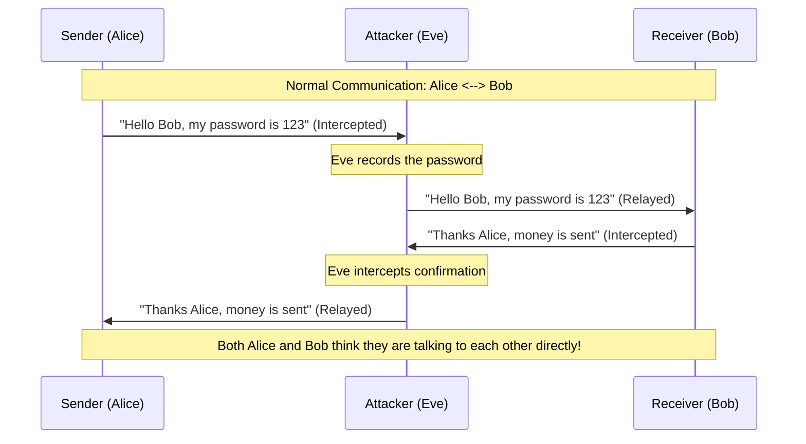

# 2024A_FE-A_30

Which type of attack involves intercepting communication between sender and receiver?

a) Brute Force Attack
b) Man-in-the-Middle Attack
c) Phishing Attack
d) Ransomware Attack
?
b) Man-in-the-Middle Attack

### Explanation

A **Man-in-the-Middle (MitM) attack** occurs when an attacker secretly intercepts, relays, and possibly alters the communication between two parties who believe they are directly communicating with each other. 

By inserting themselves in the middle of the communication flow, the attacker can eavesdrop on sensitive information (passwords, session tokens) or manipulate the data being exchanged.

#### Analyzing the Attack Types

| Attack Type | Description |
| :--- | :--- |
| **Brute Force Attack** | A trial-and-error method used to guess passwords, encryption keys, or login credentials by systematically trying all possible combinations. |
| **Man-in-the-Middle Attack** | **(Correct)** Secretly intercepting and often altering communications between a sender and a receiver. |
| **Phishing Attack** | Social engineering designed to trick a victim into revealing sensitive information by posing as a trustworthy entity. |
| **Ransomware Attack** | Malware that encrypts the victim's files and demands payment (ransom) in exchange for the decryption key. |

#### Man-in-the-Middle Attack Flow

