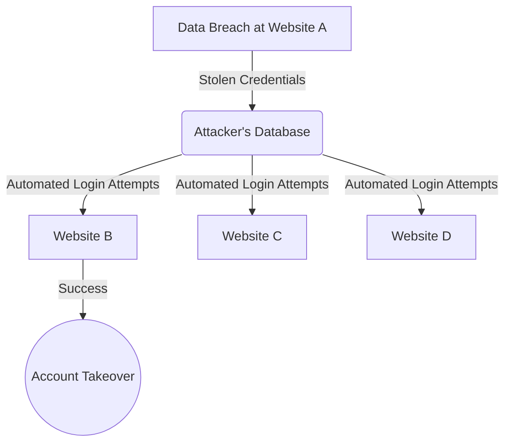

# 2024A_FE-A_31

Q31. Which of the following refers to a technique that is used in a credential stuffing attack?
a) Focusing on the case where there are users that set a word from the dictionary as their password, selecting one (1) user ID as the target of the attack, and attempting to log in using words in the dictionary and their combinations as the password
b) Focusing on the case where there are users that use the same user ID and password on multiple websites, and attempting to log in using a list of user IDs and passwords fraudulently acquired from other websites
c) Selecting one (1) frequently used password, and attempting to log in by using user IDs of all possible combinations of characters
d) Selecting one (1) user ID as the target of the attack on a website that has a low maximum number of characters for passwords, and attempting to log in by using the user ID and passwords of all possible combinations of characters
?
b) Focusing on the case where there are users that use the same user ID and password on multiple websites, and attempting to log in using a list of user IDs and passwords fraudulently acquired from other websites

### Explanation

**Credential Stuffing** is an automated cyberattack where compromised credentials (combinations of usernames/emails and passwords) collected from past data breaches are used to attempt logging into other unrelated services. It exploits the human tendency to reuse passwords across multiple websites.

Here is a breakdown of the different attack types mentioned in the choices:

| Choice | Attack Type | Mechanism |
| :--- | :--- | :--- |
| **a** | **Dictionary Attack** | Targets a specific user by trying different words from a dictionary file as the password. |
| **b** | **Credential Stuffing** | Uses known, stolen username/password pairs from other sites to test on a new site. |
| **c** | **Password Spraying** | Targets many different users using a few commonly used passwords to avoid lockout policies. |
| **d** | **Brute-Force Attack** | Targets a specific user by trying all possible combinations of characters. |

Hence, **b** perfectly describes credential stuffing.
