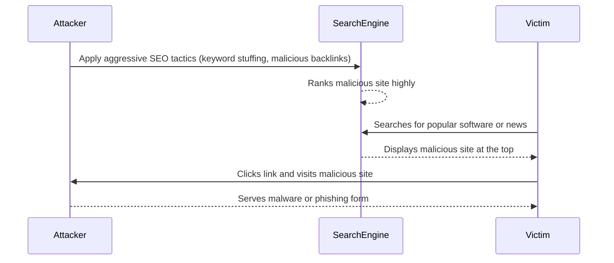

# 2024A_FE-A_32

Q32. Which of the following is the name of an attack where manipulation is made to display a malicious website near the top of the results on a search website?
a) Cross-site scripting
b) DNS cache poisoning
c) SEO poisoning
d) Social engineering
?
c) SEO poisoning

### Explanation

**SEO Poisoning (Search Engine Optimization Poisoning)** is an attack technique where malicious actors use SEO techniques to rank their harmful websites highly in search engine results for popular keywords. Unsuspecting users click on these top results and are directed to malware-infected sites or phishing pages.

Let's review the other options:

| Attack | Description |
| :--- | :--- |
| **Cross-site scripting (XSS)** | Injecting malicious client-side scripts into web pages viewed by other users. |
| **DNS cache poisoning** | Corrupting a DNS server's cache data so that a domain name resolves to the attacker's IP address. |
| **Social engineering** | Psychological manipulation of people into performing actions or divulging confidential information. |

Therefore, **c** is the correct answer.
