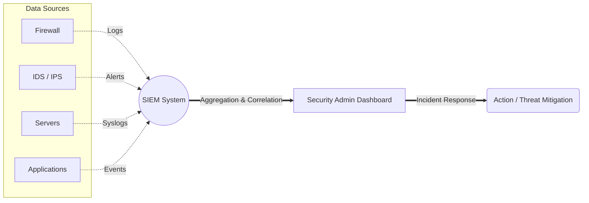

# 2024A_FE-A_33

Q33. Which of the following is a function of security information and event management (SIEM)?
a) The centralized control of a range of communication devices in a network, and the changing of network configuration and security settings
b) The execution of a file in an isolated virtual environment, and the monitoring of communication to a C&C server and other behavior
c) The general analysis of logs that are collected from a range of devices, and the support of analysis and action by an administrator
d) The inspection of header information in packets, the identification of application programs that receive communication, and the control of communication
?
c) The general analysis of logs that are collected from a range of devices, and the support of analysis and action by an administrator

### Explanation

**SIEM (Security Information and Event Management)** software provides real-time monitoring, analysis, and correlation of security alerts generated by applications and network hardware. It centrally collects and aggregates log data to identify security incidents.

**Analysis of the Options:**

| Choice | Concept Described | Explanation |
| :--- | :--- | :--- |
| **a** | **SDN (Software-Defined Networking) / MDM** | Focuses on centralized control and configuration of network nodes. |
| **b** | **Sandbox Analysis** | Executing suspicious files in a safe, isolated environment to monitor behavior. |
| **c** | **SIEM** | Centralizes logs from various devices for analysis and alerts the administrator. |
| **d** | **Firewall / IPS (Intrusion Prevention System)** | Inspects packet headers and controls communications. |

Therefore, **c** is the correct answer.
