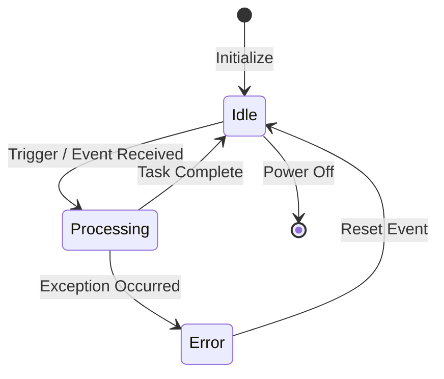

# 2024A_FE-A_34

Q34. Which of the following is the UML behavioral diagram showing the behavior of a single object in response to triggers?
a) Activity diagram
b) Sequence diagram
c) State machine diagram
d) Use case diagram
?
c) State machine diagram

### Explanation

UML diagrams are divided into two main categories: **Structural** and **Behavioral**. Within behavioral diagrams, a **State Machine Diagram** specifically models the dynamic behavior of a *single* object (or entity) as it transitions through various states in response to external events (triggers).

**Evaluation of the UML Behavioral Diagrams:**

| Diagram | Primary Focus |
| :--- | :--- |
| **Activity Diagram** | Models the step-by-step workflow, control flow, or data flow of a process. |
| **Sequence Diagram** | Shows the interaction and message passing between *multiple* objects in a time sequence. |
| **State Machine Diagram** | Shows the states and transitions of a *single* object in response to triggers. |
| **Use Case Diagram** | Models the functional requirements of a system and its interaction with external actors. |

Therefore, the correct answer is **c**.
