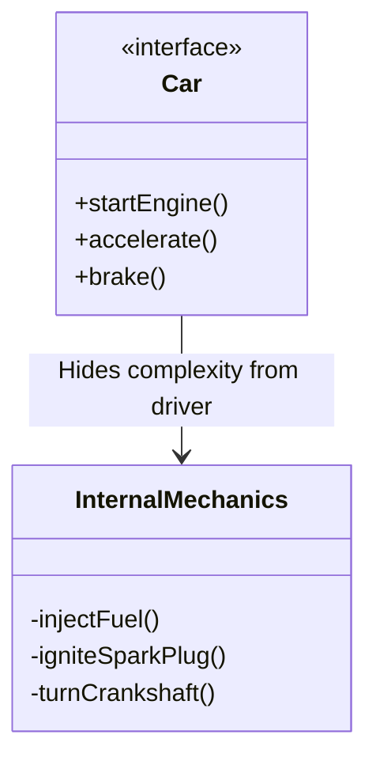

# 2024A_FE-A_35

Q35. In object-oriented programming, which of the following is abstraction?
a) Concealing implementation details and exposing only a simplified interface for interacting with objects
b) Creating a subclass instance inheriting attributes and behaviors from its superclass
c) Defining multiple methods with the same name but different parameters
d) Redefining in the child class a method that is already provided by the superclass with the same name and parameters but a different implementation
?
a) Concealing implementation details and exposing only a simplified interface for interacting with objects

### Explanation

Object-Oriented Programming (OOP) revolves around four main pillars: **Abstraction**, **Encapsulation**, **Inheritance**, and **Polymorphism**.

**Abstraction** is the concept of hiding complex internal implementation details and showing only the essential features of the object to the outside world.

*The driver only interacts with `Car`, abstracting away the `InternalMechanics`.*

**Analysis of the Options:**

| Choice | OOP Concept | Description |
| :--- | :--- | :--- |
| **a** | **Abstraction** | Hiding implementation details and providing a simple interface. |
| **b** | **Inheritance** | A subclass inheriting fields and methods from a superclass. |
| **c** | **Polymorphism (Overloading)** | Same method name with different parameters in the same class. |
| **d** | **Polymorphism (Overriding)** | A child class providing a specific implementation of a superclass's method. |

Hence, **a** is the correct answer.
