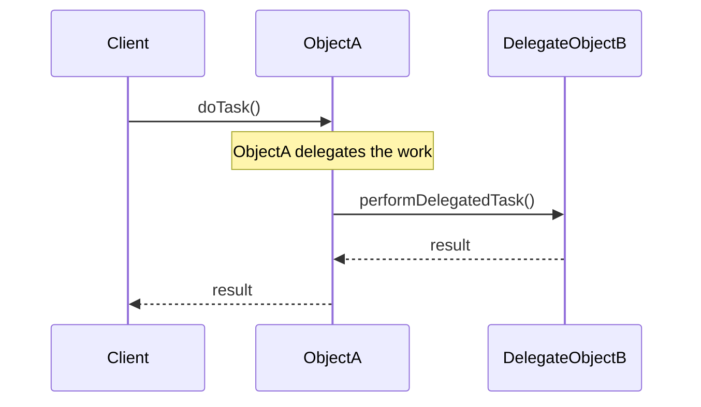

# 2024A_FE-A_36

Q36. Which of the following is an appropriate description of “delegation” in object orientation?
a) A mechanism that creates one (1) new object using multiple objects as its parts
b) A mechanism where a lower-level class inherits the attribute or operation of a higher level class
c) A mechanism where an application of an operation to a certain object automatically causes the application of that operation to related objects
d) A mechanism where an operation to a certain object is internally requested to be performed by another object
?
d) A mechanism where an operation to a certain object is internally requested to be performed by another object

### Explanation

In object-oriented programming, **delegation** refers to a pattern where an object passes responsibility for executing a task (or evaluating a method) to another associated object (the delegate). It is frequently used as an alternative to inheritance (Favor Composition over Inheritance).

**Analysis of Options:**

| Option | Object-Oriented Concept | Explanation |
| :--- | :--- | :--- |
| **a** | **Composition / Aggregation** | Building complex objects from simpler ones. |
| **b** | **Inheritance** | Deriving a new class from an existing base class. |
| **c** | **Cascading / Propagation** | Automatically applying actions (like delete) to child objects. |
| **d** | **Delegation** | Forwarding a method call to another object to handle the logic. |

Thus, **d** accurately defines delegation.
