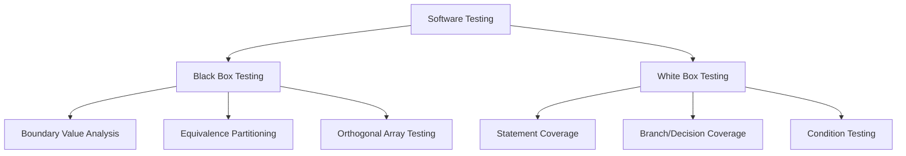

# 2024A_FE-A_37

Q37. In unit testing, which of the following activities is part of white box testing?
a) Boundary value analysis
b) Condition testing
c) Equivalence partitioning
d) Orthogonal array testing
?
b) Condition testing

### Explanation

Software testing is categorized mainly into **Black Box Testing** (internal structure is unknown) and **White Box Testing** (internal code logic is known and tested).

**Condition Testing** is a white-box testing technique where test cases are specifically designed to exercise every logical condition (e.g., `if (x > 0 && y < 10)`) within the source code, requiring full knowledge of the program's structure.

**Evaluation of the Choices:**

| Testing Technique | Box Type | Description |
| :--- | :--- | :--- |
| **Boundary Value Analysis** | Black Box | Tests values at the edges of valid partitions. |
| **Condition Testing** | White Box | Tests all possible boolean states of internal conditions. |
| **Equivalence Partitioning** | Black Box | Divides inputs into equivalence classes to test one from each. |
| **Orthogonal Array Testing** | Black Box | Uses combinatorial design for testing multiple input variables. |

Therefore, **b** is the only white-box testing technique.
