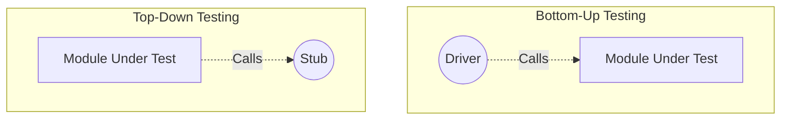

# 2024A_FE-A_38

Q38. Which of the following is the appropriate explanation of a stub or a driver used in a test?
a) A driver is a module that is called from the module to be tested
b) A driver passes arguments and calls the module to be tested
c) A stub is a module used to call the module to be tested
d) A stub is used to display or print the values returned from the module to be tested
?
b) A driver passes arguments and calls the module to be tested

### Explanation

In Integration Testing, testing often happens incrementally. When modules are not yet completed, dummy modules called **Stubs** and **Drivers** are used.

- **Driver:** A dummy *calling* module used in **Bottom-Up Testing**. It acts as the main program, passing arguments down to the sub-module being tested.
- **Stub:** A dummy *called* module used in **Top-Down Testing**. It acts as the sub-program, returning hardcoded values back up to the main module being tested.

**Analysis of the Options:**

| Choice | Evaluation | Correct Term |
| :--- | :--- | :--- |
| **a** | Incorrect. A module called *from* the module to be tested is a Stub. | Stub |
| **b** | Correct. A Driver acts as the higher-level caller. | Driver |
| **c** | Incorrect. A module used to *call* the tested module is a Driver. | Driver |
| **d** | Incorrect. A stub returns mock values to simulate functionality. | Test Harness / Assertions |

Thus, **b** is the correct statement.
