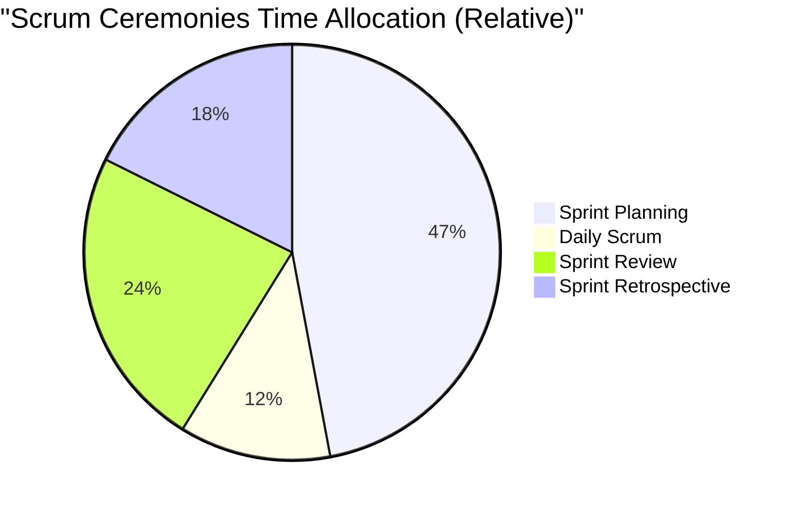

# 2024A_FE-A_39

Q39. Scrum is an agile development method. In Scrum, which of the following is an event where each member of the development team talks in turn about topics such as “things I did yesterday,” “things I will do today,” and “obstacles,” and all members share the status of a project?
a) Daily Scrum
b) Retrospective
c) Sprint planning
d) Sprint review
?
a) Daily Scrum

### Explanation

Scrum consists of several key events (ceremonies) that provide structure to the Sprint lifecycle. 

The **Daily Scrum** (or Daily Stand-up) is a 15-minute timeboxed event held every day. The Development Team uses it to synchronize activities and plan for the next 24 hours. They typically answer three questions:
1. What did I do yesterday that helped the Development Team meet the Sprint Goal?
2. What will I do today to help the Development Team meet the Sprint Goal?
3. Do I see any impediment (obstacle) that prevents me or the Team from meeting the Sprint Goal?

| Event | Purpose |
| :--- | :--- |
| **Daily Scrum** | Daily sync up, sharing progress and impediments. |
| **Sprint Retrospective** | Held at the end of the sprint to reflect on the process and find improvements. |
| **Sprint Planning** | Held at the start of a sprint to determine the sprint backlog and goals. |
| **Sprint Review** | Held at the end of a sprint to demonstrate the increment (product) to stakeholders. |

Therefore, **a** is correct.
