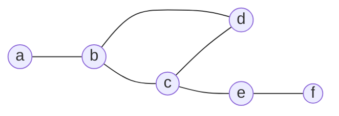

# 2024A_FE-A_4

![[2024A_FE-A_Q4_full.png]]
?
c)

### Explanation
An **adjacency matrix** represents connections between nodes in a graph. An entry of `1` in row $i$ and column $j$ means there is an edge connecting node $i$ to node $j$. Since this is an undirected graph, the matrix is symmetric.

Let's list the edges based on the matrix, looking for `1`s:
- Row `a`: `1` at `b` $\rightarrow$ Edge **(a, b)**
- Row `b`: `1` at `a`, `c`, `d` $\rightarrow$ Edges **(b, a)**, **(b, c)**, **(b, d)**
- Row `c`: `1` at `b`, `d`, `e` $\rightarrow$ Edges **(c, b)**, **(c, d)**, **(c, e)**
- Row `d`: `1` at `b`, `c` $\rightarrow$ Edges **(d, b)**, **(d, c)**
- Row `e`: `1` at `c`, `f` $\rightarrow$ Edges **(e, c)**, **(e, f)**
- Row `f`: `1` at `e` $\rightarrow$ Edge **(f, e)**

Graph **c)** is the only option that matches these connections exactly:
- `a` is connected only to `b`.
- `b` is connected to `a`, `c`, and `d`.
- `c` is connected to `b`, `d`, and `e`.
- `d` is connected to `b` and `c`.
- `e` is connected to `c` and `f`.
- `f` is connected only to `e`.

