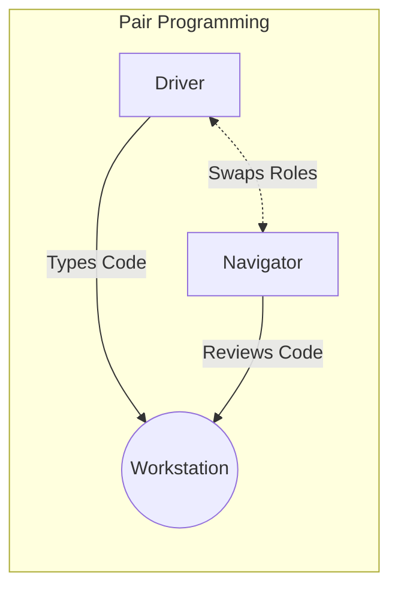

# 2024A_FE-A_40

Q40. Among eXtreme Programming (XP) practices, which of the following is adopted to improve program quality in program development through smooth communication between programmers by exchanging their roles and reviewing each other’s work?
a) Coding standard
b) Pair programming
c) Planning game
d) Test-driven development
?
b) Pair programming

### Explanation

**eXtreme Programming (XP)** is an agile framework that aims to produce higher-quality software and higher quality of life for the development team. 

**Pair Programming** is a core XP practice where two programmers share one workstation. 
- The **Driver** writes the code.
- The **Navigator** (or Observer) reviews the code as it is written, considers the strategic direction of the work, and spots bugs early.
They frequently swap roles, facilitating continuous code review and knowledge sharing.

**Other XP Practices Mentioned:**

| Practice | Description |
| :--- | :--- |
| **Coding standard** | Rules to ensure all code looks like it was written by a single, competent person. |
| **Planning game** | A meeting to plan the next release or iteration, prioritizing user stories. |
| **Test-driven development (TDD)** | Writing automated unit tests before writing the actual production code. |

Thus, **b** is the correct answer.
