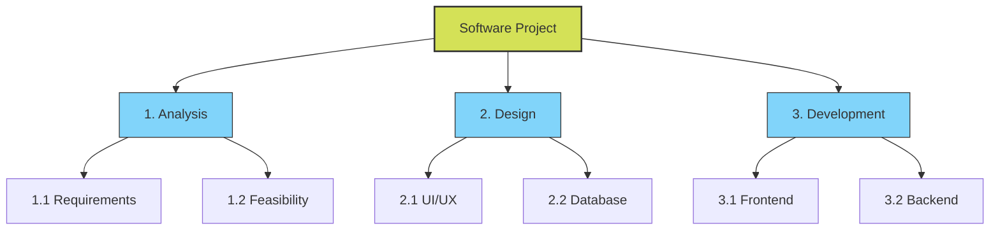

# 2024A_FE-A_41

Which of the following is an appropriate purpose for using a Work Breakdown Structure (WBS) in a software development project?

a) To clarify the sequence relation of activities and understand the critical path that should be intensively managed
b) To hierarchically detail activities and segment them into a manageable scale
c) To optimize the total cost when there is a trade-off between the duration and the cost of development
d) To represent the schedule of an activity with a horizontal bar, and clarify the start time and end time of the activity as well as the progress at the present point in time
?
b) To hierarchically detail activities and segment them into a manageable scale

### Explanation

**Work Breakdown Structure (WBS)** is a foundational project management tool that takes the overall scope of a project and breaks it down into smaller, more manageable components in a hierarchical structure. This allows project managers to accurately estimate costs, schedule tasks, and assign responsibilities.

| Option | Concept Described | Explanation |
| :--- | :--- | :--- |
| **a** | **PERT/CPM (Network Diagram)** | Focuses on task sequences and identifying the critical path (longest duration path). |
| **b** | **WBS (Work Breakdown Structure)** | **Correct.** Focuses on hierarchical decomposition of the project scope. |
| **c** | **Project Crashing / Cost Optimization** | Focuses on minimizing costs when shortening a project's duration. |
| **d** | **Gantt Chart** | Uses horizontal bars to visualize the project schedule over time. |

Here is a visual representation of how a WBS breaks down a project:

