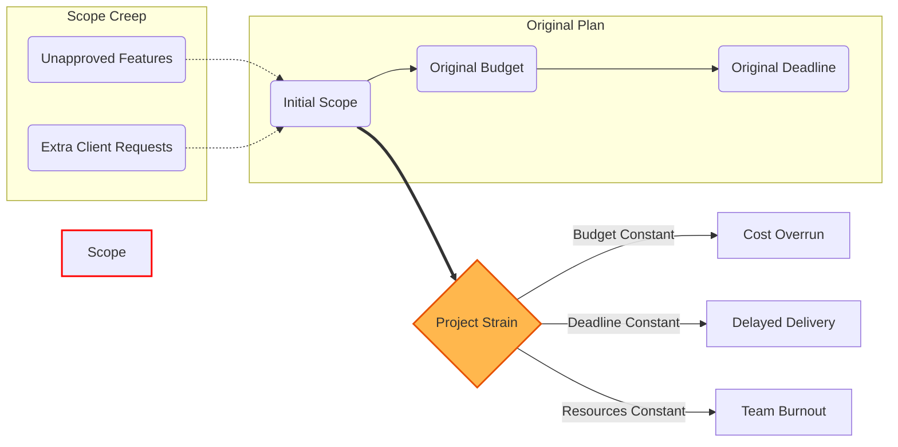

# 2024A_FE-A_42

Which of the following is an appropriate explanation concerning the scope creep in project scope management?

a) A hierarchical decomposition of the total scope of work to be carried out by the project team to accomplish the project objectives and create the required deliverables
b) Any change to the project scope, which almost consistently requires an adjustment to the project cost or schedule
c) The sum of the products, services, and results to be provided as a project
d) The uncontrolled expansion of product or project scope without adjustments to time, cost, and resources
?
d) The uncontrolled expansion of product or project scope without adjustments to time, cost, and resources

### Explanation

**Scope Creep** refers to the phenomenon where a project's requirements, goals, or vision continually grow or change in an uncontrolled manner after the project has started. Crucially, this expansion occurs **without corresponding adjustments** to the project's schedule, budget, or resources, leading to delays and cost overruns.

| Option | Concept Described | Key Distinction |
| :--- | :--- | :--- |
| **a** | **Work Breakdown Structure (WBS)** | Hierarchical decomposition of work, not a change in scope. |
| **b** | **Approved Scope Change** | A formalized change that adjusts time/cost accordingly. |
| **c** | **Project Scope** | The definition of what the project is supposed to deliver. |
| **d** | **Scope Creep** | **Correct.** Unmanaged, uncontrolled growth without adjusting resources. |

