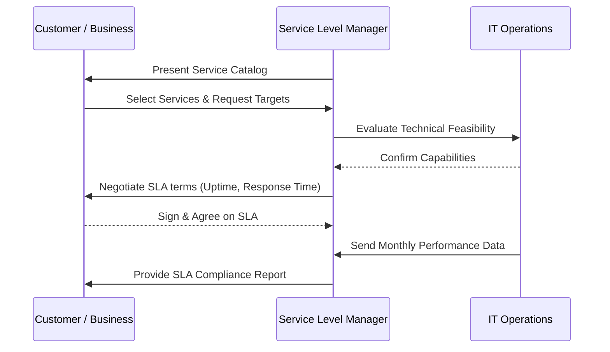

# 2024A_FE-A_43

Which of the following is a requirement for service level management?

a) A capacity plan is created, implemented, and maintained while human, technical, informational, and financial resources are considered.
b) A service catalog and SLA are created for the service to be provided, and they are agreed upon with the customer.
c) Costs are monitored and reported against the budget; the financial forecasts are reviewed, and costs are managed.
d) Risks to service continuity and availability of services are assessed and documented.
?
b) A service catalog and SLA are created for the service to be provided, and they are agreed upon with the customer.

### Explanation

**Service Level Management (SLM)** is an ITIL process responsible for negotiating, agreeing, monitoring, and reporting on IT service levels. Its primary goal is to ensure that all IT services are delivered to agreed achievable targets, documented in a **Service Level Agreement (SLA)**. 

| Option | ITIL Process | Primary Focus |
| :--- | :--- | :--- |
| **a** | **Capacity Management** | Ensuring IT infrastructure has adequate capacity to meet current/future demands. |
| **b** | **Service Level Management (SLM)** | **Correct.** Creating SLAs and managing customer expectations based on the Service Catalog. |
| **c** | **Financial Management** | Budgeting, IT accounting, and charging for IT services. |
| **d** | **IT Service Continuity Management** | Disaster recovery, risk assessment, and ensuring continuous service availability. |

