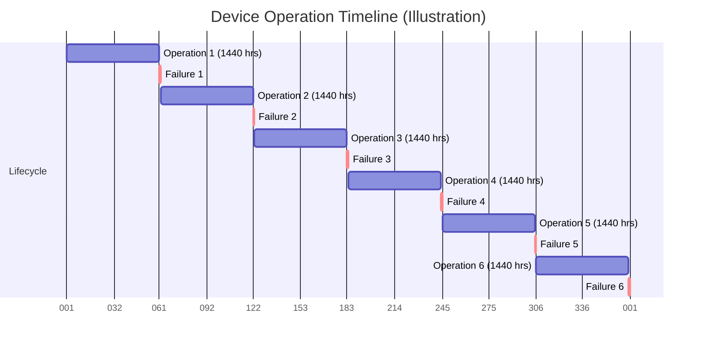

# 2024A_FE-A_44

A device that operates 24 hours a day, 360 days a year has an MTBF value of 1,440 hours. Which of the following is the average number of failures for this device for 360 days? Here, the result is rounded to the closest whole number, and the MTTR of the device is ignored.

a) 3
b) 6
c) 9
d) 12
?
b) 6

### Explanation

**MTBF (Mean Time Between Failures)** indicates the average time elapsed between inherent failures of a system during normal operation. 

To find the average number of failures, we need to divide the total operating time by the MTBF.

**Step 1: Calculate Total Operating Time**
The device operates $24 \text{ hours/day}$ for $360 \text{ days}$.
$$ \text{Total Time} = 24 \times 360 = 8,640 \text{ hours} $$

**Step 2: Calculate Number of Failures**
Since MTTR (Mean Time To Repair) is ignored, we assume the system fails and instantly resumes or the repair time is negligible.
$$ \text{Number of Failures} = \frac{\text{Total Time}}{\text{MTBF}} $$
$$ \text{Number of Failures} = \frac{8,640}{1,440} = 6 $$

| Parameter | Value |
| :--- | :--- |
| **Hours per day** | 24 |
| **Days** | 360 |
| **Total Hours** | 8,640 |
| **MTBF** | 1,440 |
| **Resulting Failures** | 6 |

*(Note: Gantt chart scale above is an abstract representation of 6 even periods across 360 days)*
