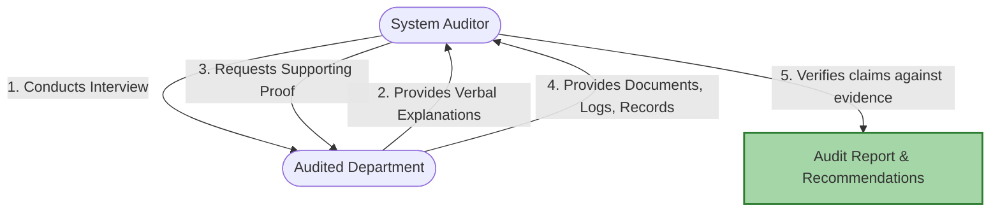

# 2024A_FE-A_45

Which of the following is the most appropriate description of a system auditor?

a) The entire audit interview must be conducted by one (1) system auditor, because discrepancies may occur in the record if multiple auditors are involved.
b) The system auditor must instruct the department being audited to implement improvement measures for deficiencies identified during the audit interview.
c) The system auditor must make an effort to obtain documents and records that support the information obtained from the department being audited during the audit interview.
d) The system auditor must select audit interviewees from administrators who have been an auditor within the department being audited.
?
c) The system auditor must make an effort to obtain documents and records that support the information obtained from the department being audited during the audit interview.

### Explanation

A **System Auditor** acts as an independent entity to verify the safety, reliability, and efficiency of information systems. The core principle of auditing is **evidence-based assessment**. Verbal information obtained during an interview is not sufficient on its own; it must be corroborated by tangible evidence.

| Option | Evaluation | Reason |
| :--- | :--- | :--- |
| **a** | Incorrect | Audits are frequently conducted by teams. Collaboration often prevents errors and bias rather than causing discrepancies. |
| **b** | Incorrect | An auditor **recommends** improvements and points out deficiencies, but it is the audited department's management that is responsible for **instructing and implementing** the changes. |
| **c** | **Correct** | The auditor must secure objective evidence (logs, records, manuals) to validate claims made during interviews. |
| **d** | Incorrect | Interviewees should be the actual personnel managing or using the system, regardless of whether they have a background as an auditor. |

