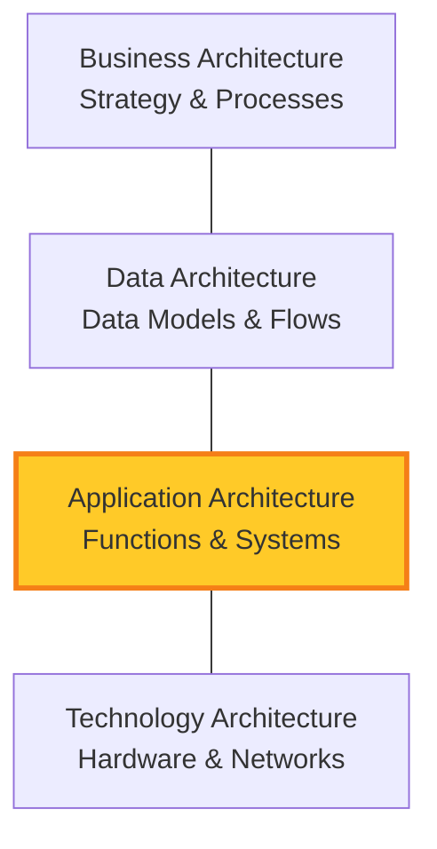

# 2024A_FE-A_46

Which of the following is an explanation of an application architecture that constitutes enterprise architecture?

a) It systematically describes the business processes or the information flows necessary for the business strategy.
b) It systematically describes the contents of the data necessary for business operations, the relations or structures between the data, etc.
c) It systematically describes the functions or system configurations that support business processes.
d) It systematically describes the technical components necessary for the developments and operations of the information systems.
?
c) It systematically describes the functions or system configurations that support business processes.

### Explanation

**Enterprise Architecture (EA)** is typically composed of four main architectural domains to align business strategy with IT capabilities:

| Domain | Description | Matches Option |
| :--- | :--- | :--- |
| **Business Architecture (BA)** | Defines the business strategy, governance, organization, and key business processes. | **a** |
| **Data Architecture (DA)** | Describes the structure of an organization's logical and physical data assets and data management resources. | **b** |
| **Application Architecture (AA)** | Provides a blueprint for the individual applications to be deployed, their interactions, and their relationships to the core business processes of the organization. | **c (Correct)** |
| **Technology Architecture (TA)** | Describes the logical software and hardware capabilities (infrastructure) that are required to support the deployment of business, data, and application services. | **d** |

