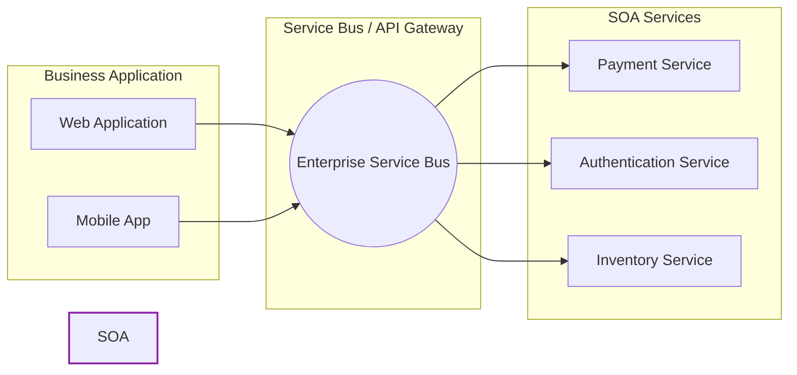

# 2024A_FE-A_47

Which of the following is a description of the SOA?

a) A concept of constructing a system by considering the software functions as components called services and combining them
b) A concept of improving sales efficiency and quality by using IT for sales activities to increase sales and profits as well as to improve customer satisfaction
c) A concept of re-designing the business processes to innovatively improve the cost, quality, service, and speed
d) Outsourcing the in-house operations that are not part of the core businesses to concentrate the management resources on the core businesses
?
a) A concept of constructing a system by considering the software functions as components called services and combining them

### Explanation

**SOA (Service-Oriented Architecture)** is an architectural design pattern in software engineering where application components provide services to other components via a communications protocol, typically over a network. These services are loosely coupled, reusable, and independently deployable.

| Option | Concept | Explanation |
| :--- | :--- | :--- |
| **a** | **SOA (Service-Oriented Architecture)** | **Correct.** Combines functional software components (services) to form an application. |
| **b** | **SFA (Sales Force Automation) / CRM** | Uses software to automate and streamline the sales process and customer interactions. |
| **c** | **BPR (Business Process Reengineering)** | Fundamentally redesigning core business processes to achieve dramatic improvements. |
| **d** | **BPO (Business Process Outsourcing)** | Contracting non-core business activities and functions to a third-party provider. |

