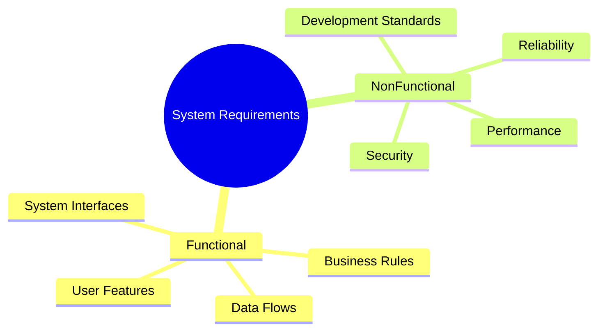

# 2024A_FE-A_48

Which of the following is the work that is performed when non-functional requirements are defined?

a) Clarifying the flow of information (i.e., data) between the functions constituting business operations
b) Clarifying the interface for exchanging information with other systems
c) Creating the technical requirements for the development criteria and standards according to the programming language used in system development
d) Defining the scope to be implemented as system functions
?
c) Creating the technical requirements for the development criteria and standards according to the programming language used in system development

### Explanation

System requirements are broadly divided into **Functional Requirements** (what the system should do) and **Non-Functional Requirements** (how well the system should perform its functions or constraints on development).

| Option | Requirement Type | Explanation |
| :--- | :--- | :--- |
| **a** | Functional | Clarifying business data flows and processes describes what the system needs to process. |
| **b** | Functional / External Interface | Defining how systems connect to exchange data is typically an interface requirement (often grouped with functional). |
| **c** | **Non-Functional** | **Correct.** Defining development constraints, programming standards, language constraints, and technical architecture rules are classified under non-functional requirements (specifically, maintainability and portability constraints). |
| **d** | Functional | Determining the functional scope directly answers "what" features to build. |

