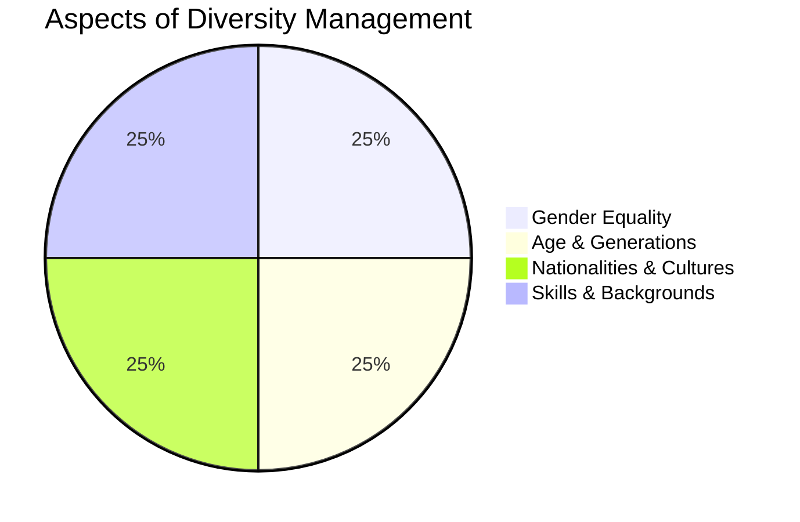

# 2024A_FE-A_49

Which of the following is an explanation of diversity management?

a) Both labor and management to reach an agreement on working conditions and work together with the aim of increasing profits
b) For employees to harmonize between work and private life, approach their work with a sense of purpose, and increase the vitality of the organization
c) For employees to take an autonomous approach to work with the aim of achieving the objectives that they set for themselves and be evaluated according to the degree of achievement
d) To increase the vitality of the organization by respecting the diversity among its employees in terms of aspects such as gender, age, and nationality
?
d) To increase the vitality of the organization by respecting the diversity among its employees in terms of aspects such as gender, age, and nationality

### Explanation

**Diversity Management** is a corporate strategy aimed at creating an inclusive workplace that embraces individuals with different backgrounds, characteristics, and perspectives. By valuing differences, companies can foster innovation and improve organizational vitality.

| Option | Business / HR Concept | Explanation |
| :--- | :--- | :--- |
| **a** | **Labor-Management Relations** | Focuses on unions, collective bargaining, and negotiations between workers and management. |
| **b** | **Work-Life Balance** | Focuses on healthy harmonization of an employee's professional and personal life. |
| **c** | **Management by Objectives (MBO)** | A performance management system where employees and managers set specific goals and evaluate based on achievement. |
| **d** | **Diversity Management** | **Correct.** Focuses on respecting demographic differences (age, gender, nationality, etc.) to drive organizational success. |

