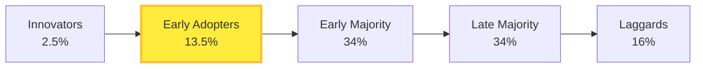

# 2024A_FE-A_50

In innovation theory, consumers are classified into five (5) groups innovators, early adopters, early majority, late majority, and laggards according to the timing of their purchase of a new product. Which of the following is the appropriate explanation of the early adopters?

a) A group that accepts a new product, service, or other such offering at an early phase, has a large impact on consumers, is sensitive to trends, and makes decisions after collecting information themselves
b) A group that accepts a new product, service, or other such offering at the soonest phase without worrying about risks
c) A group that is skeptical about the adoption of a new product or new technology and only adopts it after seeing it being adopted by most people around them
d) A group that is the most conservative, has limited interest in movements in society and tends to adopt new trends only after they become common or, in some cases, remains firm in refusing their adoption
?
a) A group that accepts a new product, service, or other such offering at an early phase, has a large impact on consumers, is sensitive to trends, and makes decisions after collecting information themselves

### Explanation

According to Everett Rogers' **Diffusion of Innovations Theory**, the market is divided into five segments based on how quickly they adopt new technologies:

| Adopter Category | Characteristics | Option Match |
| :--- | :--- | :--- |
| **Innovators (2.5%)** | First to adopt, risk-takers, high financial liquidity, and willing to accept failure. | **b** |
| **Early Adopters (13.5%)** | **Correct.** Second to adopt, visionaries, sensitive to trends. They hold high opinion leadership and influence others' buying decisions. | **a** |
| **Early Majority (34%)** | Adopt after a varying degree of time. Practical, looking for proven solutions. | N/A |
| **Late Majority (34%)** | Skeptical, adopt only after the majority of society has embraced it. | **c** |
| **Laggards (16%)** | Highly conservative, tradition-bound, last to adopt. | **d** |

