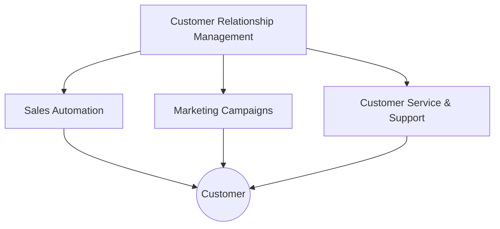

# 2024A_FE-A_51

Which of the following is a definition of Customer Relationship Management (CRM)?

a) A framework used to support and integrate processes, people, and information across an organization to provide a unified gateway for information and a knowledge base for employees, partners, and customers
b) A technology for managing all of a company’s relationships and interactions with customers and potential customers in order to improve business relationships
c) A type of software that organizations use to manage day-to-day business activities such as accounting, procurement, project management, risk management and compliance, and supply chain operations
d) The broad range of activities required to plan, control, and execute a product's flow, from acquiring raw materials and production through distribution to the final customer, in the most streamlined and cost-effective way possible
?
b) A technology for managing all of a company’s relationships and interactions with customers and potential customers in order to improve business relationships

### Explanation
**Customer Relationship Management (CRM)** is a technology and strategy for managing an organization's interactions with current and potential customers. The primary goal is to improve business relationships, aid in customer retention, and drive sales growth.

| Option | Concept | Explanation |
|---|---|---|
| a | Enterprise Information Portal (EIP) | Focuses on providing a unified gateway for internal/external information. |
| **b** | **CRM** | **Focuses on managing customer relationships to improve satisfaction and sales.** |
| c | Enterprise Resource Planning (ERP) | Focuses on integrating day-to-day business activities (accounting, procurement). |
| d | Supply Chain Management (SCM) | Focuses on the flow of goods and services from raw materials to final customer. |

