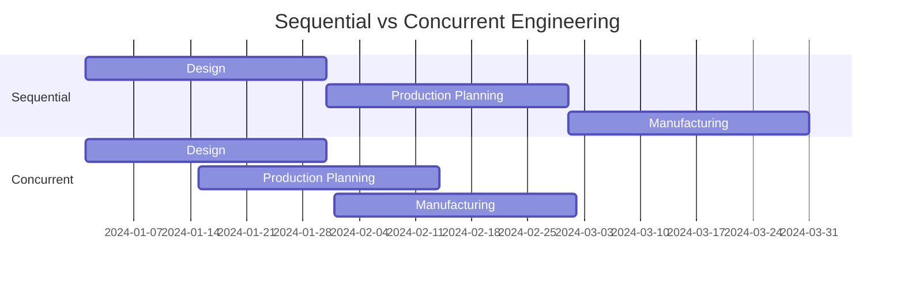

# 2024A_FE-A_52

Which of the following is an appropriate explanation of concurrent engineering?

a) A product development technique that sequentially executes processes, such as design, manufacturing, and sales activities
b) A technique that analyzes a target system and clarifies its specifications
c) A technique that executes processes, such as design and production planning, in parallel with product development
d) A technique that grasps the optimal combination of functions and costs and improves value through systematic procedures
?
c) A technique that executes processes, such as design and production planning, in parallel with product development

### Explanation
**Concurrent Engineering** is a method of designing and developing products in which different stages run simultaneously (in parallel), rather than consecutively. This approach decreases product development time and the time to market.

| Term | Corresponding Option | Description |
|---|---|---|
| Sequential Engineering | Option a | Processes are executed one after another (Waterfall approach). |
| Requirements Analysis | Option b | Clarifying specifications before proceeding. |
| **Concurrent Engineering** | **Option c** | **Parallel execution of development phases to save time and detect issues early.** |
| Value Engineering (VE) | Option d | Systematic method to improve the "value" of goods/products by optimizing function vs cost. |

