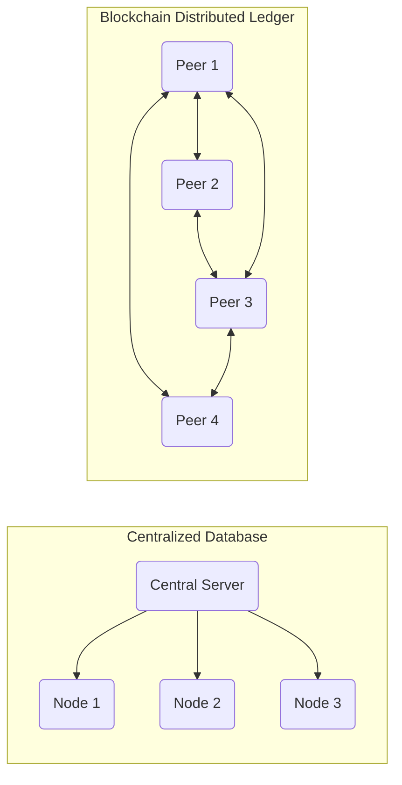

# 2024A_FE-A_53

Which of the following is one of the main characteristics of a blockchain?

a) A centralized ledger on a server
b) A client-server network
c) A distributed ledger on a peer-to-peer network
d) A type of cryptocurrency
?
c) A distributed ledger on a peer-to-peer network

### Explanation
**Blockchain** is fundamentally a **distributed ledger technology (DLT)**. It maintains a growing list of records (blocks) that are securely linked together using cryptography. The ledger is shared and synchronized across a decentralized **peer-to-peer (P2P)** network, eliminating the need for a central authority.

| Option | Analysis |
|---|---|
| a | Incorrect. Blockchain is explicitly **decentralized** and distributed, not centralized. |
| b | Incorrect. Blockchain operates on a **peer-to-peer (P2P)** network, not a client-server model. |
| **c** | **Correct. A distributed ledger maintained over a P2P network is the core defining characteristic.** |
| d | Incorrect. Cryptocurrency (like Bitcoin) is an *application* built on top of blockchain, not a characteristic of the technology itself. |

