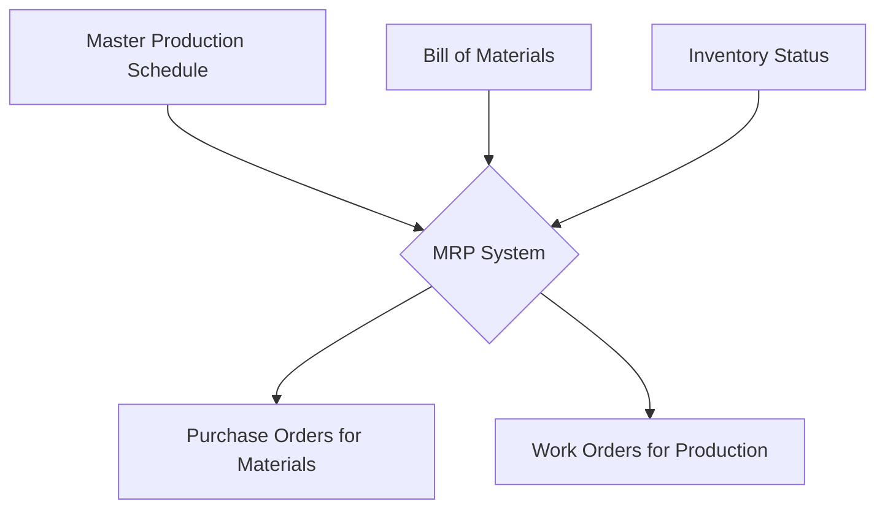

# 2024A_FE-A_54

Which of the following is the situation where an improvement can be expected by installing a Material Requirements Planning (MRP) system?

a) Drawing information is managed on both electronic files and hard copies, so the history of design changes cannot be accurately traced.
b) High-mix, low-volume production is adopted, so the cost of installing production equipment is increasing.
c) Information about materials and quantities necessary for production is complicated, so a miscalculation of order quantity or an interruption of production often occurs.
d) There are too many design changes, so production efficiency does not improve.
?
c) Information about materials and quantities necessary for production is complicated, so a miscalculation of order quantity or an interruption of production often occurs.

### Explanation
**Material Requirements Planning (MRP)** is a production planning, scheduling, and inventory control system used to manage manufacturing processes. It ensures that materials are available for production and products are available for delivery to customers.

| Scenario | Suitable System / Concept | Why? |
|---|---|---|
| Option a | **PDM (Product Data Management)** | Handles CAD models, parts information, and design change history. |
| Option b | **FMS (Flexible Manufacturing System)** | Designed to easily adapt to changes in the type and quantity of product being manufactured (high-mix, low-volume). |
| **Option c** | **MRP (Material Requirements Planning)** | **Directly computes the exact materials and quantities needed to prevent shortages and miscalculations.** |
| Option d | **Concurrent Engineering / CAD** | Streamlining design changes and improving efficiency early in the lifecycle. |

