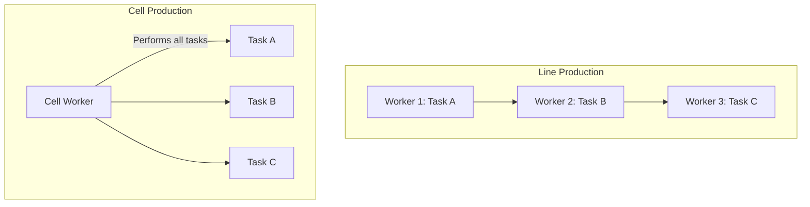

# 2024A_FE-A_55

Which of the following is the objects that can benefit from the cell production method?

a) Products that require a wide variety and flexible production
b) Products that require division of labor by standardization, simplification, and specialization
c) Products that require mass production to increase productivity
d) Products whose specifications do not change for a long period
?
a) Products that require a wide variety and flexible production

### Explanation
The **cell production method** (or cellular manufacturing) involves arranging multiple dissimilar machines in a "cell" where one or a few workers handle the entire production of a specific part or product from start to finish. It is highly adaptable and best suited for **high-mix, low-volume** production.

| Production Method | Characteristics | Best Suited For |
|---|---|---|
| **Cell Production** | Small teams or individual workers completing a product. High flexibility. | **Wide variety, flexible production (Option a)** |
| Line Production (Mass) | Division of labor, conveyor belts, specialized repetitive tasks. | Mass production, standardized specs, division of labor (Options b, c, d) |

