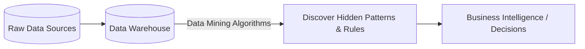

# 2024A_FE-A_56

Which of the following is a technique that can be used to discover useful information and relationships from large amounts of customer and market data retained by a company?

a) Data dictionary
b) Data flow diagram
c) Data mining
d) Data warehouse
?
c) Data mining

### Explanation
**Data Mining** is the process of analyzing massive volumes of data to discover hidden patterns, correlations, and relationships that can be turned into actionable business intelligence.

| Term | Definition |
|---|---|
| Data Dictionary | A centralized repository of information about data such as meaning, relationships to other data, origin, usage, and format. |
| Data Flow Diagram (DFD) | A graphical representation of the "flow" of data through an information system. |
| **Data Mining** | **The application of statistical techniques and algorithms to uncover useful information and relationships within large datasets.** |
| Data Warehouse | A central repository for integrated data from multiple disparate sources, used for reporting and data analysis. It *stores* the data that is subsequently *mined*. |

