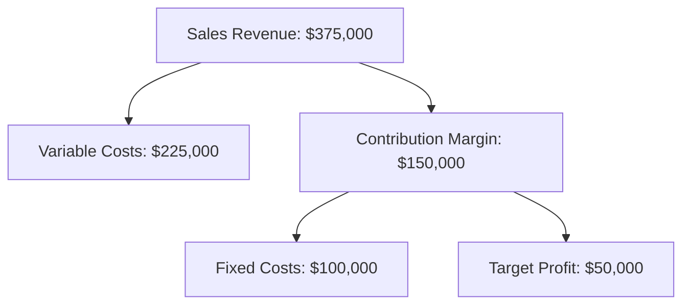

# 2024A_FE-A_59

When the selling price of a product is $50 and the fixed costs for production and sales are $100,000, which of the following is the number of units to be sold to achieve the desired profit of $50,000? Here, the variable cost ratio is 60%.

a) 5,000
b) 7,500
c) 10,000
d) 12,500
?
b) 7,500

### Explanation
This requires Cost-Volume-Profit (CVP) analysis to find the target sales volume.

**1. Given Information**
*   Selling Price per unit ($S$) = $\$50$
*   Fixed Costs ($FC$) = $\$100,000$
*   Target Profit ($P$) = $\$50,000$
*   Variable Cost Ratio ($VCR$) = $60\%$ or $0.6$

**2. Step-by-Step Calculation**
First, calculate the Variable Cost ($VC$) per unit:
$$VC = S \times VCR = \$50 \times 0.60 = \$30 \text{ per unit}$$

Next, calculate the Contribution Margin ($CM$) per unit, which is the amount from each sale that contributes to paying off fixed costs and generating profit:
$$CM = S - VC = \$50 - \$30 = \$20 \text{ per unit}$$

Finally, use the target profit formula to find the number of units ($N$):
$$\text{Sales Units} = \frac{\text{Fixed Costs} + \text{Target Profit}}{\text{Contribution Margin per Unit}}$$
$$N = \frac{100,000 + 50,000}{20}$$
$$N = \frac{150,000}{20} = 7,500 \text{ units}$$

| Metric | Formula | Value |
|---|---|---|
| Sales Revenue (for 7,500 units) | $7,500 \times \$50$ | $\$375,000$ |
| Total Variable Costs | $7,500 \times \$30$ | $-\$225,000$ |
| Total Contribution Margin | Revenue - Variable Costs | $\$150,000$ |
| Fixed Costs | Given | $-\$100,000$ |
| **Operating Profit** | **Contribution Margin - Fixed Costs** | **$\$50,000$** |

