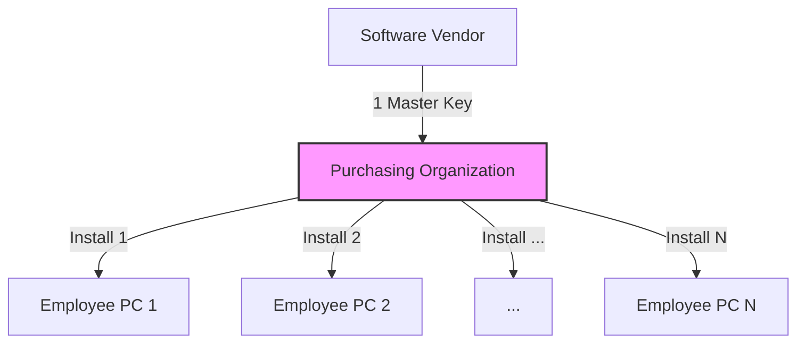

# 2024A_FE-A_60

Which of the following is an explanation of a volume license agreement?

a) A contract that establishes standard license conditions and deems that a license agreement is automatically established between the rightsholder and the purchaser when a certain amount of package is unwrapped within the scope of the standard license conditions
b) A contract that predefines the number of installations and permits the use of software for companies or other such purchasers of large amounts of software
c) A contract that restricts the location of use and permits the use of an unlimited number of units or persons within a specific facility
d) A contract where use is permitted by selecting to agree to the terms of the contract on the screen that is displayed when software is downloaded from the Internet
?
b) A contract that predefines the number of installations and permits the use of software for companies or other such purchasers of large amounts of software

### Explanation
A **volume license agreement** allows organizations (like corporations or schools) to install a specific software application on a predefined large number of computers using a single master product key, rather than purchasing and managing individual licenses for every single machine.

| License Type | Corresponding Option | Explanation |
|---|---|---|
| Shrink-wrap License | Option a | Agreement becomes active upon tearing the physical packaging. |
| **Volume License** | **Option b** | **Buying in bulk; predefines a set number of installations for corporate/large scale use.** |
| Site License | Option c | Allows unlimited usage/installations within a specific physical location or facility. |
| Click-wrap License | Option d | Agreement becomes active when the user clicks "I Agree" during digital installation. |

