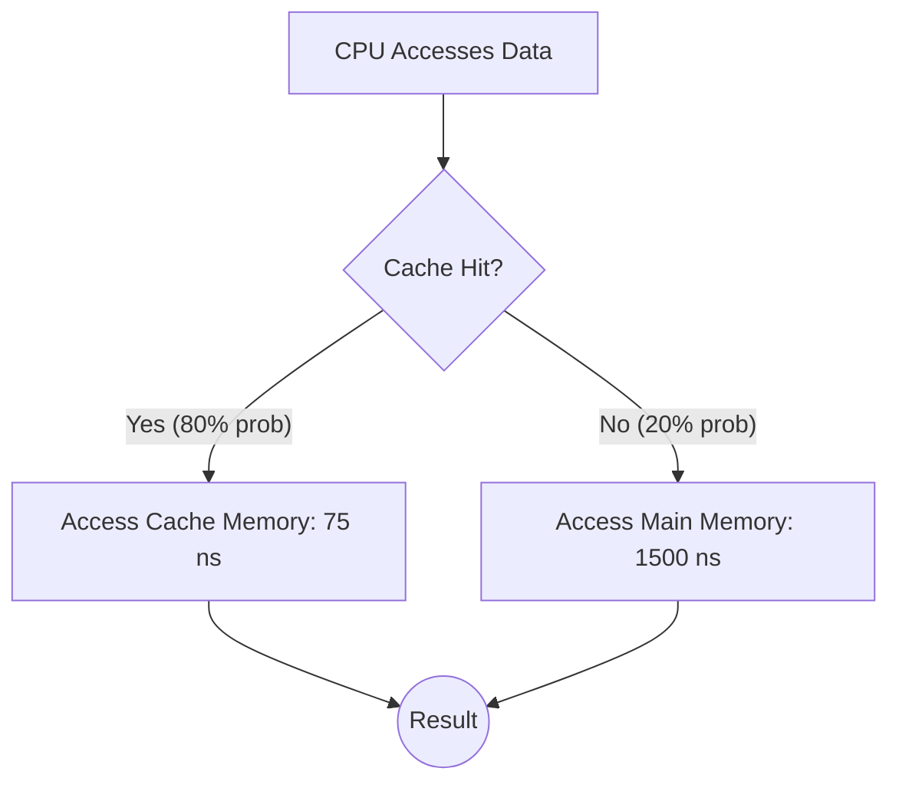

# 2024A_FE-A_9

![[2024A_FE-A_Q9_full.png]]
?
b) 360

### Explanation
To find the **Average Memory Access Time (AMAT)**, we need to calculate the weighted average of the access times based on the probability of a cache hit and a cache miss.

**Step 1: Identify Given Values**
- **Cache Miss Ratio ($M_r$)** = $0.2$
- **Cache Hit Ratio ($H_r$)** = $1 - \text{Miss Ratio} = 1 - 0.2 = 0.8$
- **Cache Memory Access Time ($T_{\text{cache}}$)** = $75 \text{ ns}$
- **Main Memory Access Time ($T_{\text{main}}$)** = $1500 \text{ ns}$ (The problem explicitly states that this time *already includes* the time to check the cache, meaning we don't need to add $T_{\text{cache}}$ on a miss).

**Step 2: Calculate Average Access Time**
The formula for Average Access Time when the main memory access time already incorporates the cache check time is:
$$ \text{AMAT} = (H_r \times T_{\text{cache}}) + (M_r \times T_{\text{main}}) $$

Substitute the values:
$$ \text{AMAT} = (0.8 \times 75) + (0.2 \times 1500) $$
$$ \text{AMAT} = 60 + 300 $$
$$ \text{AMAT} = 360 \text{ ns} $$

The average memory access time is **360 ns**.

