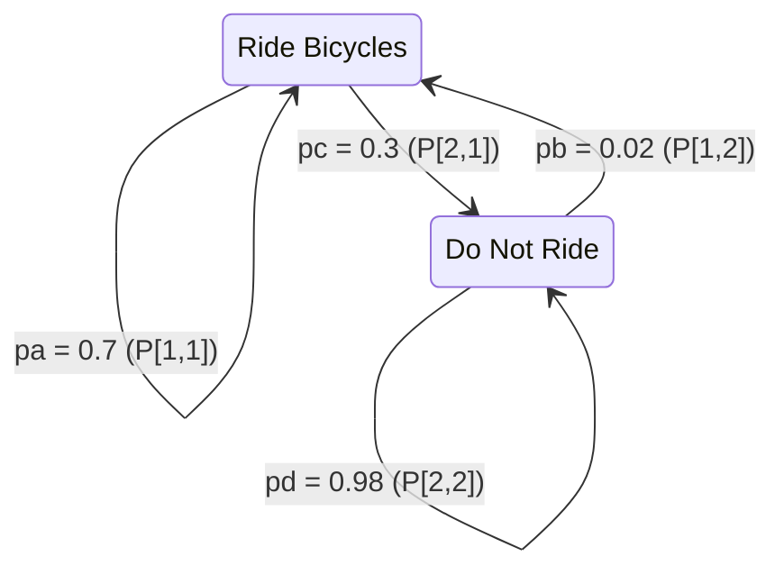

# 2024A_FE-B_1

![[2024A_FE-B_Q1_full.png]]
?
a) `P[1,1] × N[1] + P[1,2] × N[2]`, `P[2,1] × N[1] + P[2,2] × N[2]`

### Explanation

To find the number of people riding and not riding bicycles in the subsequent year, we can model this scenario using a system of linear equations (which can be represented via matrices).

Let:
- $N[1]$ be the number of people who **ride** bicycles this year ($5000$)
- $N[2]$ be the number of people who **do not ride** bicycles this year ($100000$)
- `pc` ($0.3$) is the proportion of riders who stop riding next year. Thus, the proportion of riders who **continue riding** is $pa = 1 - pc = 0.7$.
- `pb` ($0.02$) is the proportion of non-riders who start riding next year. Thus, the proportion of non-riders who **continue not riding** is $pd = 1 - pb = 0.98$.

The array $P$ is a $2 \times 2$ matrix representing these transition probabilities:
$$
P = \begin{bmatrix} P[1,1] & P[1,2] \\ P[2,1] & P[2,2] \end{bmatrix} = \begin{bmatrix} pa & pb \\ pc & pd \end{bmatrix} = \begin{bmatrix} 0.7 & 0.02 \\ 0.3 & 0.98 \end{bmatrix}
$$

The number of cyclists next year (`cycling`) is the sum of:
1. People who rode this year and continue to ride: $pa \times N[1]$ (which is $P[1,1] \times N[1]$)
2. People who did not ride this year but start riding: $pb \times N[2]$ (which is $P[1,2] \times N[2]$)

$$
\text{cycling} = P[1,1] \times N[1] + P[1,2] \times N[2]
$$

Similarly, the number of non-cyclists next year (`noncycling`) is the sum of:
1. People who rode this year but stop riding: $pc \times N[1]$ (which is $P[2,1] \times N[1]$)
2. People who did not ride this year and continue not riding: $pd \times N[2]$ (which is $P[2,2] \times N[2]$)

$$
\text{noncycling} = P[2,1] \times N[1] + P[2,2] \times N[2]
$$

This perfectly matches the formulas in option **a**.

