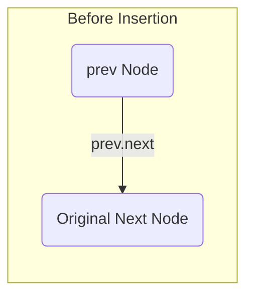
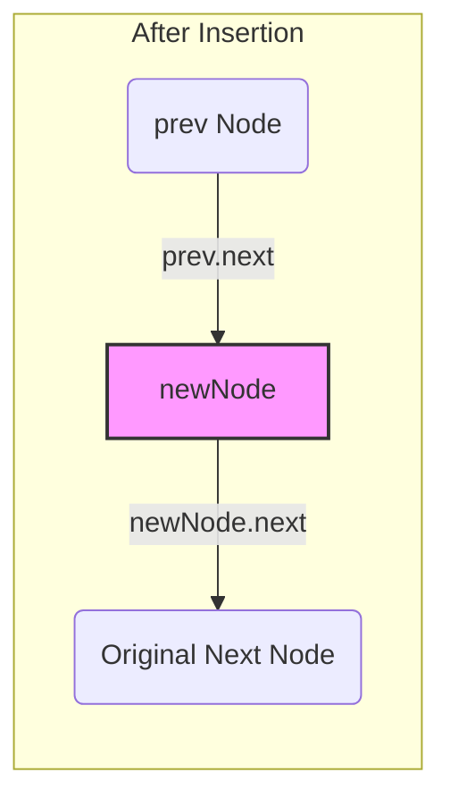

# 2024A_FE-B_10

![[2024A_FE-B_Q10_full.png]]
?
e) `prev.next`

### Explanation

This algorithm is responsible for inserting a new node (`newNode`) into a singly-linked list at a specified position (`pos`).

When inserting at a position other than the head (`pos > 1`), the algorithm must first locate the node that comes *immediately before* the desired insertion position. It uses the pointer `prev` to traverse the list.

**Traversal:**
```pseudo
prev ← listHead 
for (increase i from 2 to pos - 1 by 1) 
  prev ← prev.next 
endfor 
```
By the time this loop finishes, the `prev` pointer is pointing to the node at position `pos - 1`.

**Insertion Steps:**
To insert `newNode` between `prev` and the node that follows it (`prev.next`), two pointer updates are required:
1. The new node must point to the node that currently follows `prev`.
   `newNode.next ← prev.next` (This is provided in the program)
2. The `prev` node must be updated to point to the `newNode`, severing its old connection and establishing the new link in the chain.

Therefore, the blank must be the assignment that makes the `prev` node point to `newNode`:
`prev.next ← newNode`

This corresponds to option **e**.



