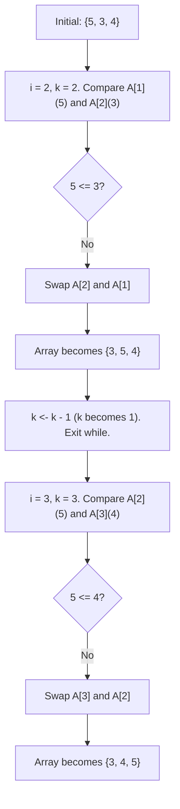

# 2024A_FE-B_11

![[2024A_FE-B_Q11_full.png]]
?
f) A: swap A[k] and A[k - 1], B: k ← k - 1

### Explanation

This pseudocode implements the **Insertion Sort** algorithm. 

#### Step-by-Step Analysis:
1. **Loop Structure**: The outer `for` loop iterates through the array from the second element (`i = 2`) to the end. The variable `k` is set to `i`, representing the current element to be inserted into the sorted portion.
2. **Comparison**: The `while` loop checks if the current element `A[k]` is smaller than the previous element `A[k - 1]`. If `A[k - 1] \le A[k]`, it is in the correct order, and the loop exits.
3. **Swapping (Blank A)**: If the previous element is greater, they must be swapped to move the smaller element towards the front. Thus, **Blank A** is `swap A[k] and A[k - 1]`.
4. **Decrementing Index (Blank B)**: After swapping, we must continue checking the newly swapped element against the elements before it. This requires moving our index `k` backward by 1. Thus, **Blank B** is `k <- k - 1`.

#### Diagram of Insertion Sort Trace

