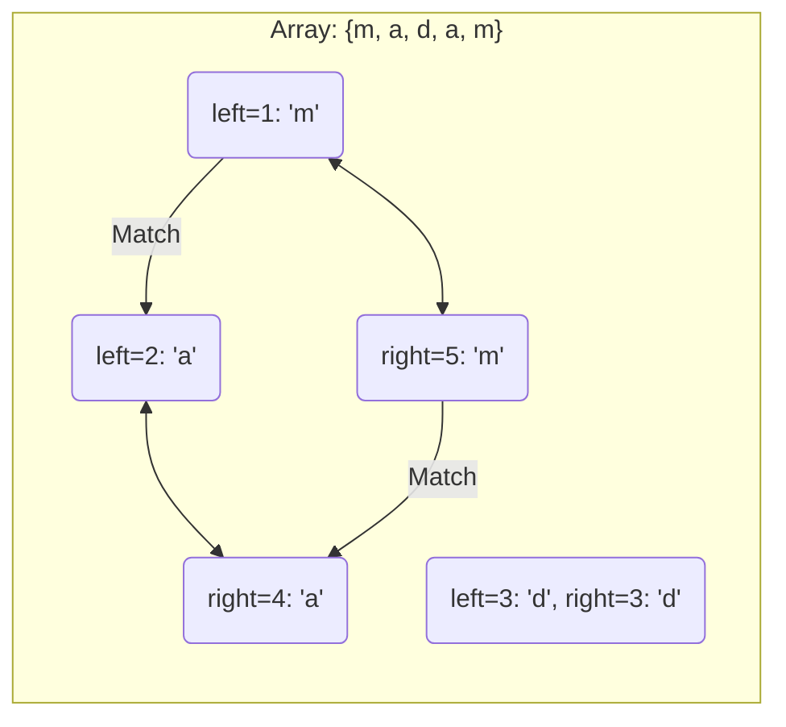

# 2024A_FE-B_12

![[2024A_FE-B_Q12_p1.png]]
![[2024A_FE-B_Q12_p2.png]]
?
b) A: s[left] = s[right], B: right ← right − 1

### Explanation

This pseudocode checks if a given string (character array `s`) is a **palindrome** by comparing characters from both ends moving towards the center.

#### Step-by-Step Analysis:
1. **Initialization**: Two pointers are used. `left` starts at the beginning (`1`), and `right` starts at the end (`the number of elements in s`).
2. **Matching (Blank A)**: In the `while (left < right)` loop, we must check if the character at the `left` index matches the character at the `right` index. Therefore, **Blank A** is `s[left] = s[right]`.
3. **Pointer Updates (Blank B)**: If they match, we move the pointers inward to check the next set of characters. The `left` pointer is incremented (`left <- left + 1`), and the `right` pointer must be decremented. Thus, **Blank B** is `right <- right - 1`.
4. **Mismatch**: If they do not match, the `else` block executes, setting `ok <- false` and breaking out of the loop since the word is not a palindrome.

#### Diagram of Palindrome Check

