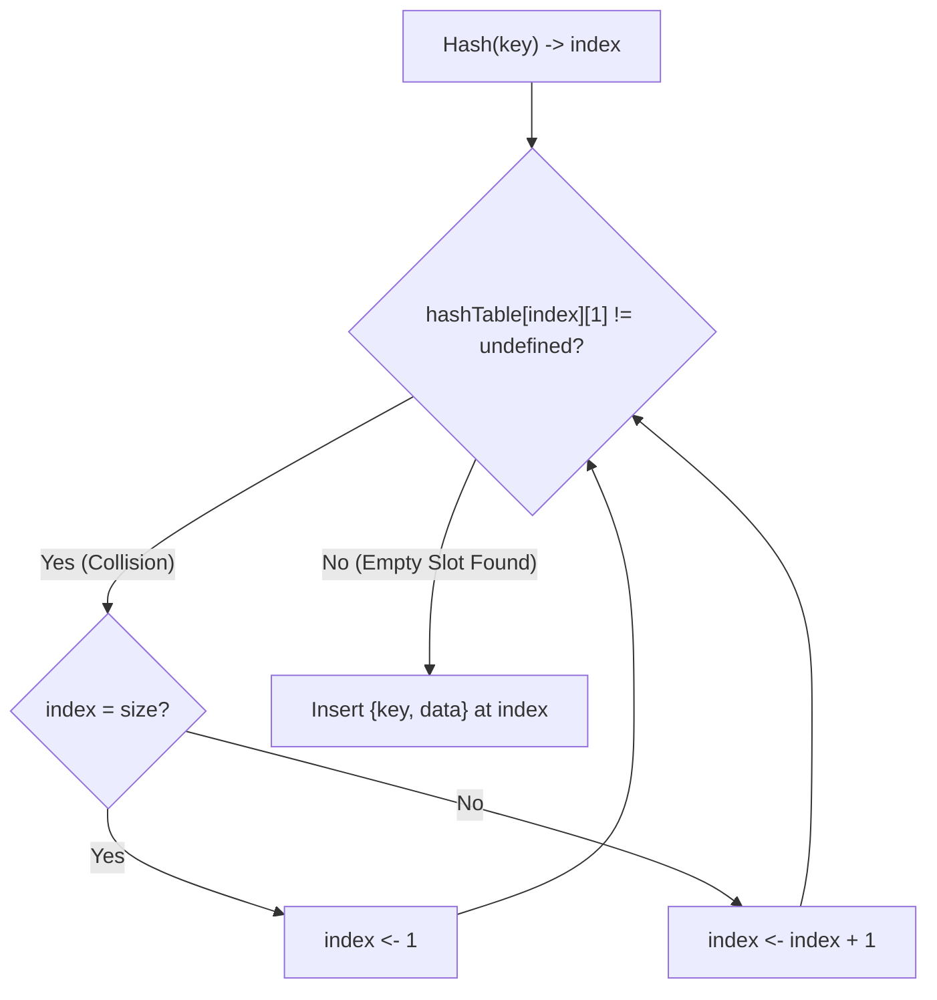

# 2024A_FE-B_13

![[2024A_FE-B_Q13_p1.png]]
![[2024A_FE-B_Q13_p2.png]]
?
e) A: hashTable[index][1] ≠ undefined, B: index ← 1

### Explanation

This algorithm implements **Linear Probing**, which is a collision resolution strategy in Hash Tables. When a hashed index is already occupied, the algorithm probes the next sequential slot until an empty (undefined) slot is found.

#### Step-by-Step Analysis:
1. **Finding an Empty Slot (Blank A)**: The `while` loop is meant to keep searching as long as the current slot is occupied. A slot is occupied if its key part (the first element, `hashTable[index][1]`) is not `undefined`. Therefore, **Blank A** must be `hashTable[index][1] ≠ undefined`.
2. **Wrapping Around (Blank B)**: If the `index` reaches the end of the array (`index = size`), it must wrap around to the beginning of the array to continue probing. Since array indices in this pseudocode start at 1, the index must be reset to 1. Thus, **Blank B** is `index <- 1`.

#### Diagram of Linear Probing

