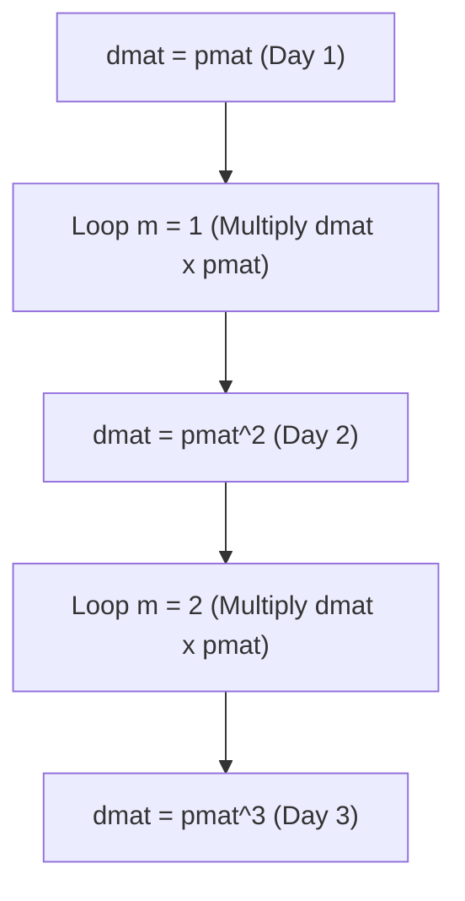

# 2024A_FE-B_15

![[2024A_FE-B_Q15_p1.png]]
![[2024A_FE-B_Q15_p2.png]]
?
a) A: 2, B: dmat[i, k] × pmat[k, j]

### Explanation

This program computes the probability distribution of a Markov chain after 3 days. Given the daily transition matrix `pmat`, the probability distribution after 3 days is obtained by computing $P^3$, where $P$ is the transition matrix. 

#### Matrix Multiplication Logic:
To compute $P^3$, we can multiply the initial matrix $P$ by itself twice ($P \times P \times P$). 
- The initial state `dmat` is set to `pmat` ($P^1$).
- To reach $P^3$, the outer loop needs to perform matrix multiplication **2 times**. Therefore, `m` must loop from 1 to 2. **Blank A is 2**.

#### Matrix Dot Product (Blank B):
The triple nested loop (`i`, `j`, `k`) performs standard matrix multiplication between `dmat` and `pmat`. 
For the element at row `i` and column `j` in the new matrix `smat`:
$smat_{i, j} = \sum_{k=1}^{3} (dmat_{i, k} \times pmat_{k, j})$
Since the loop iteratively adds to `smat[i, j]`, the term being added is `dmat[i, k] * pmat[k, j]`. Thus, **Blank B is `dmat[i, k] * pmat[k, j]`**.

