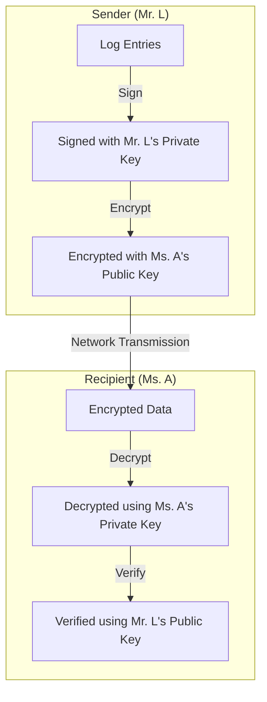

# 2024A_FE-B_19

![[2024A_FE-B_Q19_full.png]]
?
d) A: signed using Mr. L’s private key, B: encrypted using Ms. A’s public key

### Explanation

This question involves using **Public Key Infrastructure (PKI)** concepts (RSA keys) to achieve both **Confidentiality** and **Authentication / Non-repudiation** when transmitting data.

#### Step-by-Step Analysis:

1. **Authentication (Blank A)**:
   - *Condition*: "Ms. A must confirm that the sender of the file is Mr. L."
   - *Action*: Mr. L must create a digital signature. A digital signature is generated by encrypting the hash of the data with the sender's **private key**. Anyone with Mr. L's public key can verify it, proving it came from Mr. L.
   - *Result*: **signed using Mr. L's private key**.

2. **Confidentiality (Blank B)**:
   - *Condition*: "Mr. L must encrypt the file such that only Ms. A can view it."
   - *Action*: Mr. L must encrypt the data using the recipient's **public key**. Because only Ms. A possesses the corresponding private key, only Ms. A can decrypt and read the file.
   - *Result*: **encrypted using Ms. A's public key**.

#### Cryptography Flow Diagram

