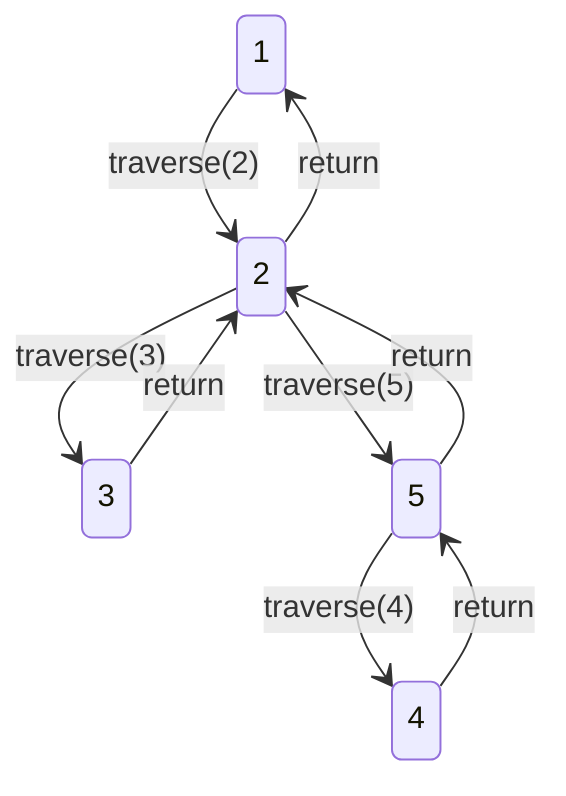

# 2024A_FE-B_9

![[2024A_FE-B_Q9_full.png]]
?
b) `1, 2, 3, 5, 4`

### Explanation

The provided algorithm is a **Depth-First Search (DFS)** implemented using recursion. 
It starts at a vertex `k`, marks it as visited, outputs it, and then iterates through all potential neighbors `i` (from 1 to 5). If an unvisited neighbor is found (`graph[k][i] = 1`), it immediately makes a recursive call to `traverse(i)`, diving deeper into the graph before checking other neighbors of `k`.

Let's trace `traverse(1)` step-by-step:

1. **`traverse(1)` starts**
   - `visited[1] = true`
   - **Output:** `1`
   - Loop `i` from 1 to 5:
     - `i = 1`: False (no self edge)
     - `i = 2`: `graph[1][2] = 1` and `visited[2] = false`. Go to `traverse(2)`

2. **`traverse(2)` starts** (called from 1)
   - `visited[2] = true`
   - **Output:** `2`
   - Loop `i` from 1 to 5:
     - `i = 1`: `visited[1]` is true (skip)
     - `i = 2`: False
     - `i = 3`: `graph[2][3] = 1` and `visited[3] = false`. Go to `traverse(3)`

3. **`traverse(3)` starts** (called from 2)
   - `visited[3] = true`
   - **Output:** `3`
   - Loop `i` from 1 to 5:
     - Only neighbor is 2 (`graph[3][2] = 1`), but `visited[2]` is true (skip).
   - Loop finishes. Returns to `traverse(2)`.

4. **Back in `traverse(2)`**
   - Continue loop from `i = 4`:
     - `i = 4`: `graph[2][4] = 0` (no edge)
     - `i = 5`: `graph[2][5] = 1` and `visited[5] = false`. Go to `traverse(5)`

5. **`traverse(5)` starts** (called from 2)
   - `visited[5] = true`
   - **Output:** `5`
   - Loop `i` from 1 to 5:
     - `i = 2`: `visited[2]` is true (skip)
     - `i = 4`: `graph[5][4] = 1` and `visited[4] = false`. Go to `traverse(4)`

6. **`traverse(4)` starts** (called from 5)
   - `visited[4] = true`
   - **Output:** `4`
   - Loop `i` from 1 to 5:
     - `i = 1`: `visited[1]` is true (skip)
     - `i = 5`: `visited[5]` is true (skip)
   - Loop finishes. Returns to `traverse(5)`.

7. **Winding down**
   - `traverse(5)` finishes. Returns to `traverse(2)`.
   - `traverse(2)` finishes. Returns to `traverse(1)`.
   - `traverse(1)` continues loop `i = 3` to `5`, but all nodes are now visited. Returns.

The final output order is `1, 2, 3, 5, 4`. This matches option **b**.

