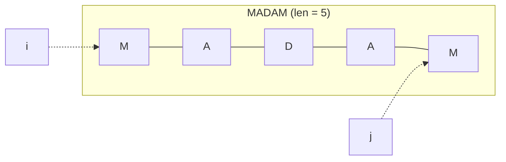

# 2024S_FE-B_12

![[2024S_FE-B_Q12_p1.png]]
![[2024S_FE-B_Q12_p2.png]]
?
b) i < (len ÷ 2) + 1

### Explanation
The function `isPalindrome` checks if a string reads the same forwards and backwards.
It uses two pointers:
- `i` starts at the beginning of the string (`1`).
- `j` starts at the end of the string (`len`).

In each iteration, it compares the `i`-th character with the `j`-th character. If they do not match, the string is not a palindrome (`flag <- false`), and the loop terminates. If they match, `i` is incremented and `j` is decremented.

To use the **minimum number of iterations**, the loop should only run until the middle of the string is reached. We do not need to check past the middle because those pairs have already been compared.

Let's analyze the stopping condition for the `while` loop:
If `len = 5` (e.g., `"MADAM"`):
- Iteration 1: `i = 1`, `j = 5`. Compare `M` and `M`. `i` becomes `2`, `j` becomes `4`.
- Iteration 2: `i = 2`, `j = 4`. Compare `A` and `A`. `i` becomes `3`, `j` becomes `3`.
- Iteration 3: `i = 3`, `j = 3`. Compare `D` and `D`. `i` becomes `4`, `j` becomes `2`.
Since checking `i = 3` and `j = 3` is just comparing the middle character to itself, we can even stop before it, but based on the options, let's see which condition correctly stops the loop optimally.
We want to loop while `i < j` essentially. Let's look at the given options:

a) `i < j - 1` : If `len = 5`, `i=2`, `j=4`, `2 < 3` is True. Next `i=3`, `j=3`, `3 < 2` is False. This misses the `i=2, j=4` case if we evaluate at `i=2`.
Let's test `b) i < (len ÷ 2) + 1`:
- `len = 5`. `(5 ÷ 2) = 2`. `2 + 1 = 3`. So `i < 3`.
  - `i = 1`: `1 < 3` (True).
  - `i = 2`: `2 < 3` (True).
  - `i = 3`: `3 < 3` (False). Loop terminates. Number of iterations = 2.
Checking `i=1` and `i=2` is perfectly sufficient for a 5-character string.

- `len = 6` (e.g., `"ABCCBA"`). `(6 ÷ 2) = 3`. `3 + 1 = 4`. So `i < 4`.
  - `i = 1`: `1 < 4` (True).
  - `i = 2`: `2 < 4` (True).
  - `i = 3`: `3 < 4` (True).
  - `i = 4`: `4 < 4` (False). Loop terminates. Number of iterations = 3.
Checking `i=1, 2, 3` is perfectly sufficient for a 6-character string.

Thus, **b) i < (len ÷ 2) + 1** provides the minimum necessary iterations to check for a palindrome.
