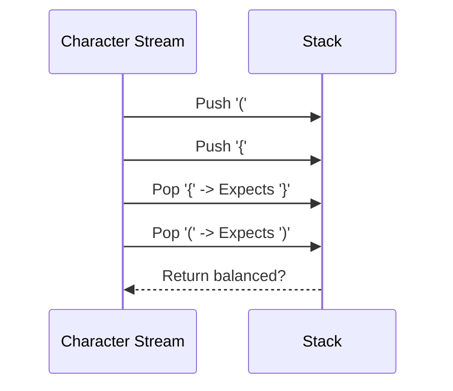

# 2024S_FE-B_13

![[2024S_FE-B_Q13_p1.png]]
![[2024S_FE-B_Q13_p2.png]]
?
h) ≠ c | stack.isEmpty() | chars[2]

### Explanation
This program checks if a sequence of brackets is balanced using a **Stack**. 
The `brackets` array maps opening brackets to closing brackets:
```text
brackets = { {"(", ")"}, {"{", "}"}, {"[", "]"} }
```



**Function `get_closing_bracket(c)`**:
This function should return the corresponding closing bracket for a given opening bracket `c`.
- It iterates through the `brackets` array (`chars` will be an array like `{"(", ")"}`).
- `chars[1]` is the opening bracket, `chars[2]` is the closing bracket.
- If `chars[1] = c`, it should return the closing bracket, which is **`chars[2]`**.
- Therefore, **C = `chars[2]`**.

**Function `are_brackets_balanced(expr)`**:
- It iterates over each character `c` in the expression.
- If `c` is an opening bracket, it pushes it onto the stack.
- If `c` is a closing bracket (the `else` block), it must match the most recent opening bracket.
  - If the stack is empty, there is a closing bracket with no opening bracket, so return `false`.
  - It pops the last opening bracket from the stack into `stacked_bracket`.
  - It checks if the closing bracket for `stacked_bracket` matches `c`.
  - If `get_closing_bracket(stacked_bracket) ≠ c`, the brackets are mismatched, so return `false`.
  - Therefore, **A = `≠ c`**.
- After processing all characters, the stack should be empty if all brackets were balanced. If the stack is not empty, there are unmatched opening brackets.
  - It should return `true` if `stack.isEmpty()` is true, and `false` otherwise.
  - Therefore, **B = `stack.isEmpty()`**.

The correct combination is **h) ≠ c, stack.isEmpty(), chars[2]**.
