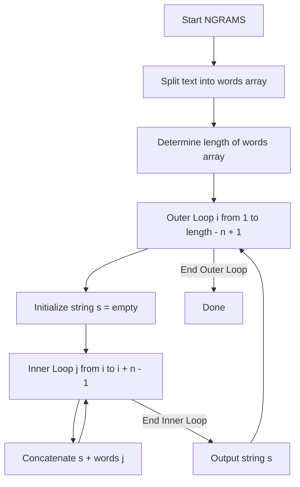

# 2024S_FE-B_15

![[2024S_FE-B_Q15_p1.png]]
![[2024S_FE-B_Q15_p2.png]]
?
i) length - n + 1 | i + n - 1

### Explanation
The `NGRAMS` procedure generates n-grams from a given text.
- An n-gram is a contiguous sequence of $n$ words.
- The total number of words is stored in `length`.

To construct each n-gram, the algorithm uses a sliding window of size $n$:
1. The **outer loop (`i`)** dictates the starting word of the current n-gram.
   Since an n-gram needs $n$ words, the starting index `i` can only go up to the point where there are still $n$ words remaining.
   For example, if `length = 6` and `n = 3` (trigram), the starting indices can be 1, 2, 3, and 4.
   Thus, the upper bound for the outer loop is `length - n + 1`.
   - **A = `length - n + 1`**

2. The **inner loop (`j`)** iterates over the words that make up the current n-gram, starting from index `i`.
   Since we need exactly $n$ words, the indices will be $i, i+1, \dots, i+n-1$.
   For example, if `i = 2` and `n = 3`, `j` should loop from 2 to 4 (`2 + 3 - 1`).
   Thus, the upper bound for the inner loop is `i + n - 1`.
   - **B = `i + n - 1`**

Therefore, the correct combination is **i) length - n + 1, i + n - 1**.
