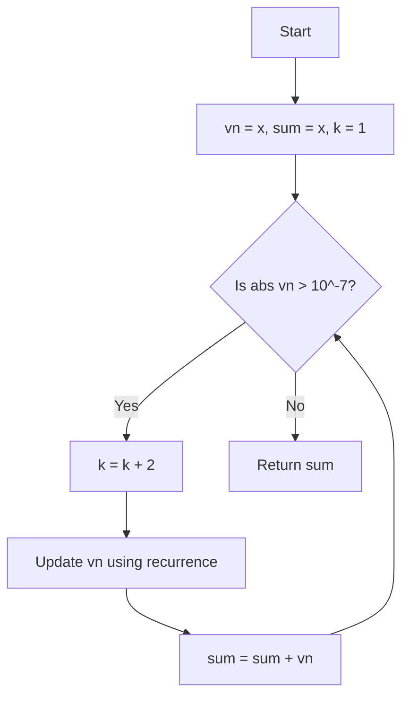

# 2024S_FE-B_16

![[2024S_FE-B_Q16_p1.png]]
![[2024S_FE-B_Q16_p2.png]]
?
h) > epsi | - vn * x^2 / ((k - 1) * k)

### Explanation
The `m_sin` function calculates $\sin(x)$ using the Maclaurin expansion:
$$ \sin(x) = \frac{x}{1!} - \frac{x^3}{3!} + \frac{x^5}{5!} - \dots + (-1)^n \frac{x^{2n+1}}{(2n+1)!} $$



The program accumulates this series iteratively:
- `k` starts at $1$ and increments by $2$ each time ($1, 3, 5, \dots$).
- `vn` holds the current term being added to `sum`.
- Initially, `vn = x` and `k = 1`.

**Condition for A (`while (abs(vn) ___A___)`)**:
The loop should continue until the absolute value of the current term is $\leq 10^{-7}$. 
This means it must *keep looping* as long as the absolute value is strictly *greater* than `epsi`.
- **A = `> epsi`**

**Update step for B (`vn <- ___B___`)**:
We need to find the relationship between the current term `vn` (which corresponds to $k_{old}$) and the next term (which corresponds to $k_{new} = k_{old} + 2$).
Let's denote the terms as $T_k$.
$$ T_k = (-1)^{\frac{k-1}{2}} \frac{x^k}{k!} $$
The next term is $T_{k+2}$:
$$ T_{k+2} = (-1)^{\frac{k+1}{2}} \frac{x^{k+2}}{(k+2)!} $$
To find how to calculate $T_{k+2}$ from $T_k$, we divide them:
$$ \frac{T_{k+2}}{T_k} = \frac{- \frac{x^{k+2}}{(k+2)!}}{\frac{x^k}{k!}} = - \frac{x^2}{(k+1)(k+2)} $$

In the program, `k` is *updated first* before calculating the next `vn`.
```text
k <- k + 2
vn <- ___B___
```
So, when we are at the line `vn <- ___B___`, the variable `k` already holds the *new* value ($k_{new}$). 
The formula to update `vn` based on the new `k` is:
$$ \text{new\_vn} = \text{old\_vn} \times \left( - \frac{x^2}{(k-1) \times k} \right) $$

Thus, the update expression is `- vn * x^2 / ((k - 1) * k)`.
- **B = `- vn * x^2 / ((k - 1) * k)`**

Therefore, the correct combination is **h) > epsi, - vn × x² ÷ ((k - 1) × k)**.
