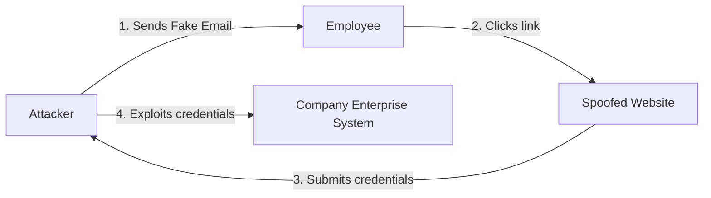

# 2024S_FE-B_17

![[2024S_FE-B_Q17_p1.png]]
![[2024S_FE-B_Q17_p2.png]]
?
c) phishing | email directing someone to a spoofed web site

### Explanation
The scenario describes an employee receiving a deceptive email urging them to click a link to "update bank account information" to avoid delaying their paycheck. 

This is a classic **phishing** attack. The goal of phishing is to trick the recipient into revealing sensitive information, such as passwords or financial details.

How it is typically conducted:
Phishing attacks are most commonly executed via **emails that direct victims to a spoofed (fake) website**. The provided link (`https://www.example.com/company-s/...`) may look legitimate at a glance, but the attacker controls the site and uses it to capture whatever data the victim enters.

- **Man in the middle (MITM)** involves secretly intercepting and possibly altering communications between two parties. It is not typically initiated by a deceptive email asking for a direct link click to update info.
- **SQL injection** involves inserting malicious SQL statements into entry fields for execution (e.g., to dump the database contents).

Therefore, the correct combination is **c) phishing, email directing someone to a spoofed web site**.
