# 2024S_FE-B_18

![[2024S_FE-B_Q18_p1.png]]
![[2024S_FE-B_Q18_p2.png]]
?
f) web server's public key | employees' public key | employee's private key

### Explanation
This question tests understanding of Public Key Infrastructure (PKI) and how asymmetric cryptography is used for HTTPS and email security (S/MIME).

```mermaid
graph TD
    subgraph "HTTPS Certification"
    WS[Web Server] -->|Sends CSR with Web Server's Public Key| CA[Certificate Authority]
    CA -->|Signs with CA's Private Key| Cert[Signed Certificate]
    end
    
    subgraph "Email Encryption"
    Sender[Partner/Customer] -->|Encrypts email using| EPK[Employee's Public Key]
    EPK --> Receiver[Employee reads with Private Key]
    end
    
    subgraph "Email Digital Signature"
    EmpSender[Employee] -->|Signs email using| EPrK[Employee's Private Key]
    EPrK --> CustReceiver[Customer verifies with Public Key]
    end
```

**A:** To enable secure connections via HTTPS, the web server needs a digital certificate. 
A certificate binds an identity to a **public key**. The server generates a key pair (public/private). It keeps the private key secret and submits a Certificate Signing Request (CSR) containing the **web server's public key** (and its identity details) to the Certificate Authority (CA). The CA signs this with its own private key.
- **A = web server's public key**

**B:** To allow partners and customers to send **encrypted email** to Company X employees, the senders must encrypt the emails using the **recipient's (employee's) public key**. Only the employee, holding the corresponding private key, can decrypt it. Therefore, Company X must publish the employees' public keys in the directory.
- **B = employees' public key**

**C:** To send **digitally signed email** messages, the sender must create the digital signature using their own **private key**. The recipients will verify the signature using the sender's public key. Thus, employees need their own private key installed on their email clients to sign outbound messages.
- **C = employee's private key**

Therefore, the correct combination is **f) web server's public key, employees' public key, employee's private key**.
