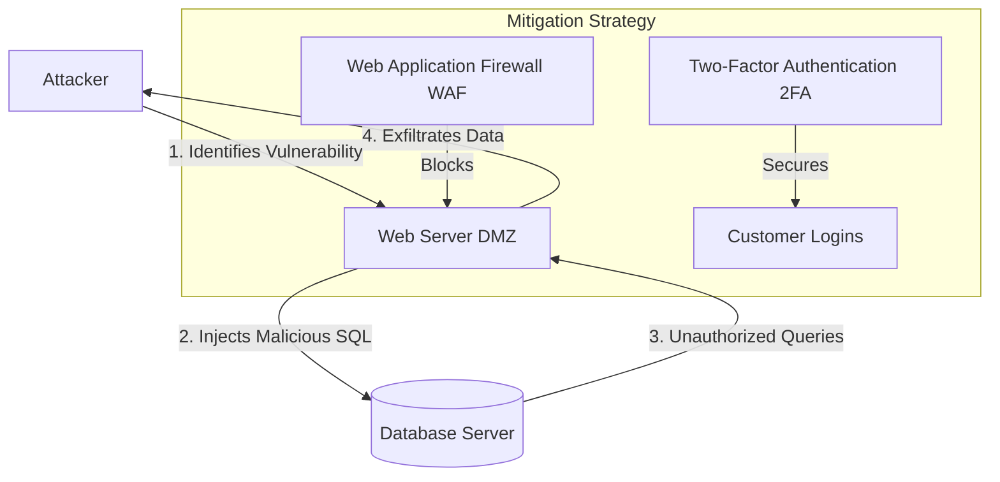

# 2024S_FE-B_19

![[2024S_FE-B_Q19_full.png]]
?
f) SQL injection | web application firewall

### Explanation
The scenario outlines a situation where customer accounts were compromised (leading to fake reviews) and unauthorized database access occurred (illegal queries executed without admin logins). 

**Issue A (Cause of account compromise):**
The IT team concluded that incidents are likely caused by using the same password on other leaked sites and **online brute force attacks** or **SQL injection**. However, since the text specifically highlights "illegal queries executed with no trace of administration login," the primary attack vector used to directly compromise the database structure and potentially harvest data (like emails to brute-force) or manipulate it is **SQL Injection**. In the options, "connection tapping" is less likely for an HTTPS setup, leaving "online brute force attacks" and "SQL injection."

The text states: "The IT team also discovered unauthorized access to the database with illegal queries executed with no trace of administration login." This is the definition of **SQL Injection**. Since they were compromised by the same password on other sites AND SQL injection (which likely exposed further vulnerabilities or direct access), A must be **SQL injection**.

**Issue B (Mitigation):**
To mitigate SQL Injection, you would use a **web application firewall (WAF)**. A WAF sits in front of the web application and inspects HTTP traffic to detect and block malicious payloads like SQL injection strings.

If A was "online brute force attacks", the mitigation (B) could be CAPTCHA or more complex password policies, but neither of these addresses the "illegal queries executed" on the database. 

Therefore, A is **SQL injection** and B is **web application firewall**.

The correct combination is **f) SQL injection, web application firewall**.
