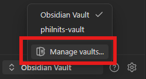
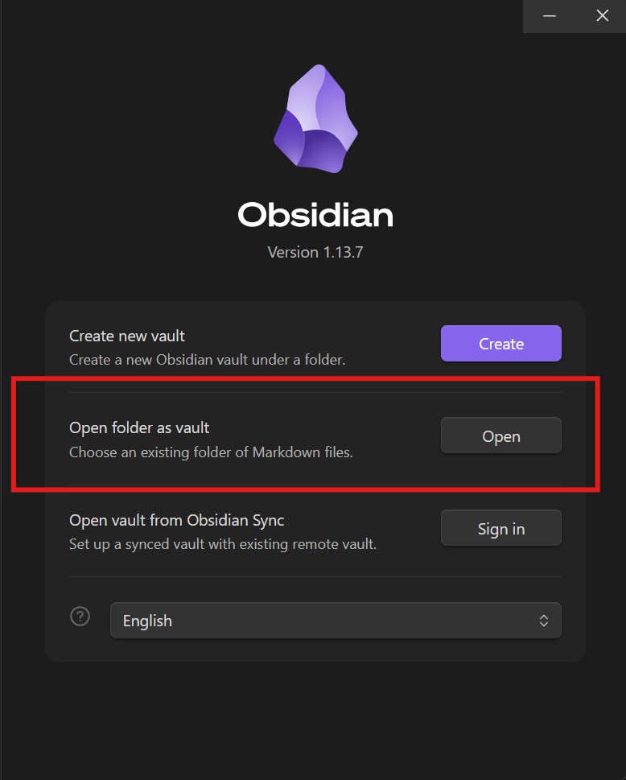
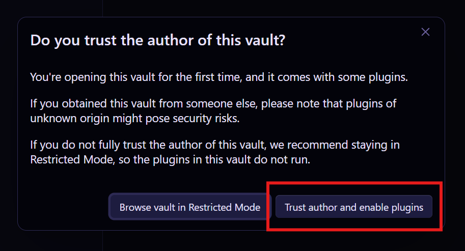

# philnits-vault

A flashcard Obsidian vault containing all past exam questions & explanations for the PhilNITS exam: created to collaboratively prepare for the upcoming PhilNITS exam in a single week.

> [!NOTE]
> This repository is a fork maintained by [@Joryuoo](https://github.com/Joryuoo) and [@jangkayl](https://github.com/jangkayl).
> - **Fork Repository:** [https://github.com/Joryuoo/pelnets.git](https://github.com/Joryuoo/pelnets.git)
> - **Original Upstream:** [https://github.com/usc-cisco/philnits-vault](https://github.com/usc-cisco/philnits-vault)

## What's New in this Fork

This fork significantly improves the original vault's flashcard organization and architecture:

1. **Yearly Exam Decks (`#year/YYYY`)**:
   - Allows studying **all questions from a specific exam year** (e.g., all questions under 2016, 2018, 2019, 2020, 2021, 2022, 2023, 2024, 2025, or 2026) in a single consolidated deck, regardless of category.
2. **Topic by Year Subdecks (`#topic/YYYY`)**:
   - Every topic category is partitioned into subdecks by exam year (e.g., `networking/2022`, `digital-logic/2018`), allowing targeted subject review for specific years.
3. **Simultaneous 3-Way Deck Organization**:
   - Study however you prefer without losing other views:
     - By **broad subject** (e.g. `networking`)
     - By **subject and year** (e.g. `networking` → `2022`)
     - By **entire exam year** (e.g. `year` → `2022`)
4. **Standard YAML Frontmatter (`tags: [...]`)**:
   - Migrated all question notes across all years to official Obsidian YAML frontmatter format.
   - **Update-proof & future-proof:** Works natively with the official Obsidian Spaced Repetition plugin without custom plugin patches, so updating the plugin will never break deck organization.
   - **Clean card display:** Metadata is properly encapsulated in frontmatter so raw header text (`Category: #...`) no longer clutters the front of flashcards.
5. **Complete Category Registration**:
   - Registered all 30 subject tags in plugin settings (including `#cloud-computing` and `#artificial-intelligence`). Refer to [[Registered_Categories.md]] for the complete directory.

## Usage

### 1. Clone the Repository

```bash
# Clone this fork:
git clone https://github.com/Joryuoo/pelnets.git

# (Or if you are cloning the original upstream repository:)
# git clone https://github.com/usc-cisco/philnits-vault.git
```

### 2. Open the Vault in Obsidian

**Step 1:** Open Obsidian. At the bottom-left corner of the sidebar, click on your current vault name and select **Manage vaults...**:



**Step 2:** Under **Open folder as vault**, click **Open**:



> [!TIP]
> Navigate to the folder where you cloned the repository:
> - Select **`pelnets`** if you cloned this fork repo.
> - Select **`philnits-vault`** if you cloned the original upstream repo.

**Step 3:** Trust the author & enable plugins:



> [!CAUTION]
> **Trust at your own risk 💀**
> *Trust me or not, but you can trust me the same way you trust an AI with 100MB of confidential data just to draft a 2-sentence email.*
>
> *(I promise there's no crypto miner in here, just IT exam questions that will hurt your brain equally as much. Source: trust me bro).*
>
> Click **"Trust author and enable plugins"** so that the Spaced Repetition flashcard system and vault configurations can run.

**Step 4:** Once the vault opens, click the **Review flashcards** button on the left ribbon to start practicing!

### Troubleshooting: Can't Review Previously-Reviewed Flashcards

> [!WARNING]
> The Spaced Repetition plugin will set a timer with a minimum of 1 day before the next time you can review the card.

To work around this, you have to do `CTRL + P > Spaced Repetition: Select a deck to cram` to review all the cards in the deck, ignoring the schedule of previously-reviewed cards.

## Conventions on Creating Flashcards

> [!NOTE]
> To create a new note, do `CTRL + N` and write the name before doing `CTRL + T` to select the `000 Flashcard` template.

Take note of the following labelling conventions.

- note names should correspond to the PDF related to it together with the question number.
  - ie. question #55 `2023A_FE_AM_Questions.pdf` turns into `2023A_FE_AM_55`
- always add both the **topic category with the exam year** (`category-name/YYYY`) and the **exam year tag** (`year/YYYY`) to the `tags:` list in the frontmatter.
  - this structure automatically populates:
    - **Topic decks** (e.g. `digital-logic`)
    - **Topic/Year subdecks** (e.g. `digital-logic/2024`)
    - **Yearly decks** containing all questions for that exam year (e.g. `year/2024`)
  - view the list of [[#Available Flashcard Categories]].
  - multiple topic tags can be added if a question covers multiple domains (e.g. `math/2019` and `programming/2019`).
  - feel free to add more categories if none of the existing ones cover the topic your question is related to.
    - discuss it between the contributors before adding it.

### Flashcard Format

```md
---
created: YYYY-MM-DD HH:mm
status: "#philnits"
tags:
  - category-name/YYYY
  - year/YYYY
---

# 2024S_FE-A_83

What is the question of the current number?
a) wrong
b) wrong
c) answer
d) wrong
?
c) answer

This is an explanation detailing the different actions or concepts taken to understanding the answer.

You can use LaTeX syntax in between two $$ like $\frac{a_{1}}{x^{2}}$.

You can also copy paste images into the explanation with CTRL + V.

This is the end of the explanation, I hope you now understand why c) is the answer at the first line of the card's back.

%% ignore this, it's the flashcard terminator %%
---

# References %% add your references here %%

-
```

- put the correct answer in the FIRST LINE of the flashcard answer.
- the separator for the front & back of the flashcard is the `?` character on a new line.
- the end marker of a flashcard is a `---` separator in a new line.

## Available Flashcard Categories

> [!NOTE]
> Feel free to add more as necessary after discussing with the other flashcard contributors.
>
> - these determine the flashcard deck partitions.

- `#number-systems`
	- binary, decimal, octal, hexadecimal number conversions
- `#operating-systems`
	- CPU scheduling, kernel, functionalities, types of OS
- `#project-management`
	- project management concepts, Scrum, Agile, Waterfall Method
- `#accounting`
	- balance sheets, profit calculation, P/L statements
- `#probability`
	- statistics, probability
- `#cybersecurity`
	- Information Security
- `#systems-architecture`
	- UML2
- `#sets`
	- union, interception, Venn Diagram word problems
- `#digital-logic`
	- Boolean algebra, logic circuits
- `#algorithms`
	- Common algorithms
- `#hardware`
	- Computer architecture and physical components
- `#data-structures`
	- Stacks, Queues, Trees, Graphs
- `#programming`
	- Strings, Integers, Characters, Programming Languages
- `#web-technologies`
	- JavaScript, CSS, Ajax
- `#information-management`
	- Databases, SQL
- `#statistics`
	- Correlations, Regressions
- `#networking`
	- OSI layers, subnetting, network topology, protocols
- `#service-management`
	- ITIL, Service Strategy, IT Service Management, IT Service Delivery & Reliability
- `#math`
	- algebraic problems, basic arithmetic word problems 
- `#software`
	- general software-related topics i.e., graphics software
- `#data-encoding`
	- ways to format, send, and store data, compression, data serialization, decoding
- `#business-administration`
	- business development, analysis, strategy, secretary work
- `#software-testing`
	- test-driven development, terminology, types of tests, test automation
- `#devops`
	- system administration, server provisioning, automated deployment, system integration, containerization
- `#automata-theory`
	- state transitions, automata questions
- `#software-engineering`
	- software lifecycle, design patterns, architecture, maintenance
- `#object-oriented-programming`
	- OOP concepts, inheritance, polymorphism, encapsulation, classes
- `#cloud-computing`
	- IaaS, PaaS, SaaS, private/public/hybrid cloud, multi-tenancy
- `#artificial-intelligence`
	- Machine learning, deep learning, neural networks, NLP, conversational AI

> [!TIP]
> For detailed topic descriptions, keywords, and mapping rules, see [[Registered_Categories.md]].